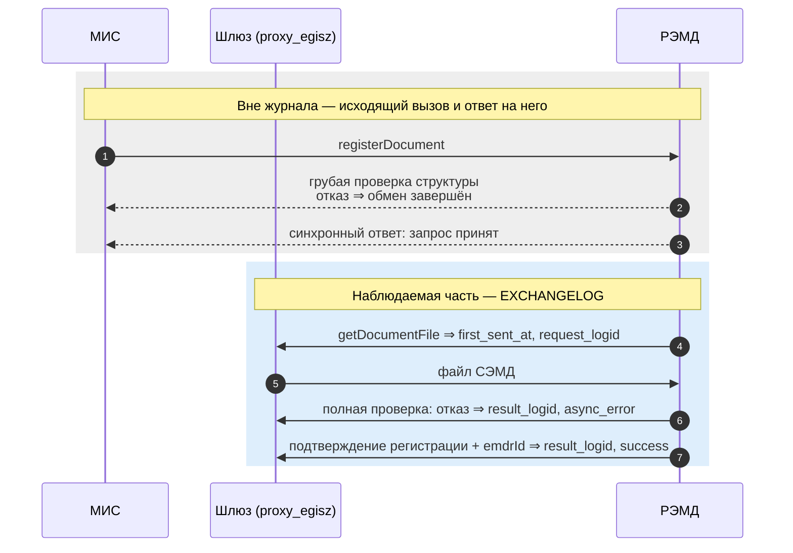
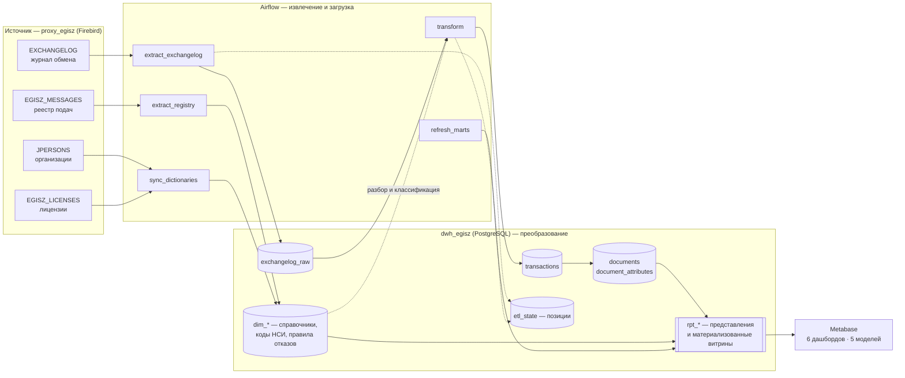
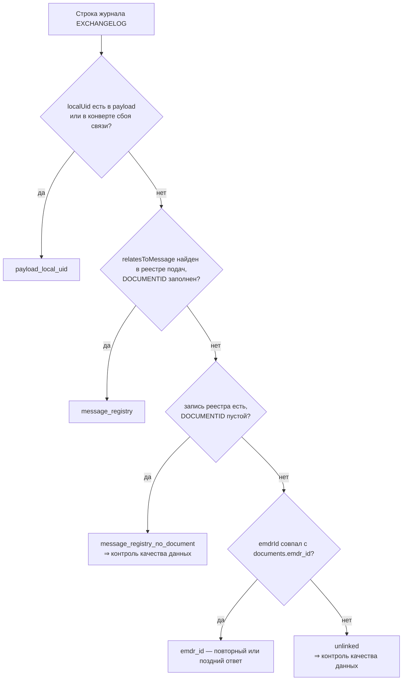
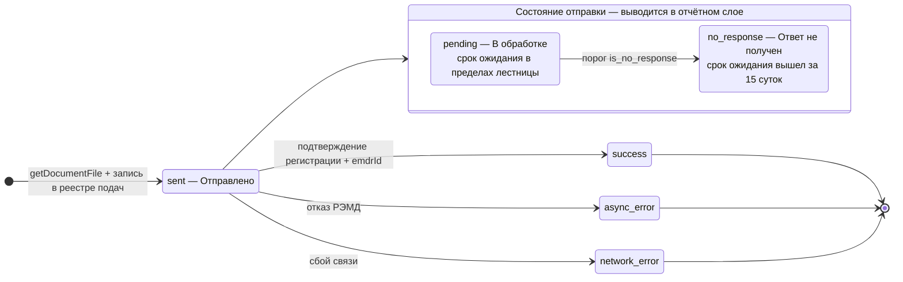
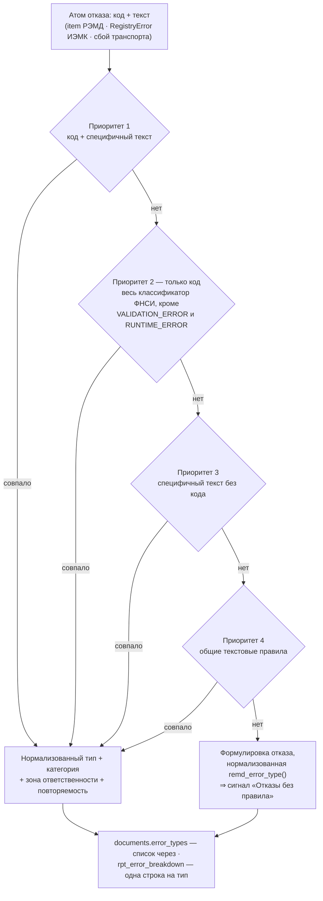

# Сервис эксплуатационной аналитики обмена с ЕГИСЗ

Сервис эксплуатационной аналитики обрабатывает журнал обмена с ЕГИСЗ: принимает сообщения шлюза, разбирает SOAP/XML, загружает факты в DWH PostgreSQL, формирует витрины `rpt_*` и публикует отчёты в Metabase.

Репозиторий содержит Airflow DAG, SQL-модель DWH, правила разбора и классификации отказов, JSON-дашборды Metabase и скрипты развёртывания.

## С чего начать

Разделы рассчитаны на разного читателя — начинать стоит со своего.

| Читатель | Задача | Маршрут |
| -------- | ------ | ------- |
| Дежурная поддержка | Понять, что происходит с обменом сейчас | [Работа с анализом отправки](#работа-с-анализом-отправки) → [Классификация ошибок](#классификация-ошибок) → [Запуск контуров](#запуск-контуров) |
| Аналитик | Построить или проверить отчёт | [Состав аналитики](#состав-аналитики) → [DWH-модель](#dwh-модель) → [Дашборды Metabase](#дашборды-metabase) |
| Разработчик конвейера | Изменить разбор или модель данных | [Архитектура и поток данных](#архитектура-и-поток-данных) → [Парсинг и нормализация](#парсинг-и-нормализация) → [Связывание сообщений](#связывание-сообщений) → [Сборка документа](#сборка-документа) |
| Тот, кто принимает систему | Понять предмет и границы достоверности | [Контекст](#контекст-егисз-сэмд-обмен-и-где-в-нём-наш-контур) → [Состав аналитики](#состав-аналитики) → [Управленческий дашборд](#управленческий-дашборд-05_executivejson) |

Остальные разделы: [Источник данных](#источник-данных), [ELT-конвейер](#elt-конвейер), [Версии и идентичность документа](#версии-и-идентичность-документа), [Глоссарий](#глоссарий), [Источники методологии](#источники-методологии). Перечень типов отказов и условия правил вынесены в [справочник ошибок](docs/error-catalog.md).

Локальные значения по умолчанию:

| Компонент | Адрес | База / ресурс | Учётка |
| --------- | ----- | ------------- | ------ |
| Firebird proxy | `localhost:3050` | `proxy_egisz` | `sysdba` / `masterkey` |
| PostgreSQL DWH | `localhost:5432` | `dwh_egisz` | `egisz` / `egisz` |
| Airflow UI/API | `http://localhost:8080` | namespace `egisz-bi` | задаётся контуром Airflow |
| Metabase | `http://localhost:3000` | коллекция `Интеграция с ЕГИСЗ` | `admin@egisz.local` / `egisz` |

---

## Контекст: ЕГИСЗ, СЭМД, обмен и где в нём наш контур

**ЕГИСЗ** — единая государственная информационная система в сфере здравоохранения. Для клиники ключевое взаимодействие — передача **СЭМД** (структурированных электронных медицинских документов) в **РЭМД** (реестр электронных медицинских документов).

Между МИС и ЕГИСЗ стоит проксирующий шлюз. Он пишет сообщения в журнальную БД **`proxy_egisz`** (Firebird). Сервис строит на её основе документную витрину для BI и оперативного контроля.

### Схема регистрации СЭМД и что из неё видит журнал

По методическому документу «Описание выполняемых проверок в РЭМД» регистрация состоит из одиннадцати шагов и включает два этапа проверки и два ответа — синхронный на приём запроса и асинхронный на результат. Журнал шлюза видит не весь обмен: он фиксирует входящие вызовы ЕГИСЗ→шлюз, поэтому исходящая подача и синхронный ответ на неё в нём отсутствуют.



Отсюда следуют два свойства модели данных.

**Первое наблюдаемое событие документа — запрос файла со стороны РЭМД.** Он выполняется уже после того, как запрос прошёл проверки первого этапа, и именно его момент попадает в `first_sent_at`. Дата подачи документа медицинской системой находится вне журнала.

**Синхронные отказы в отчётность не входят.** При отказе на первом этапе обмен завершается до запроса файла, и в журнале не остаётся ни одной строки. Доля успеха и объёмы считаются по событиям, представленным в журнале шлюза.

---

## Состав аналитики

Семь срезов эксплуатационной аналитики; каждый опирается на витрины DWH и вкладки дашборда «Интеграция с ЕГИСЗ» либо на отдельные клиентские дашборды.

| Срез | Содержание | Витрина / представление |
| ---- | ---------- | ----------------------- |
| Отправка и состояния | Объёмы, состояния, динамика по клиникам и типам СЭМД | `rpt_documents` |
| Обратная связь | Отправленные без ответа, корреляция подачи и ответа | `rpt_documents_sent`, `rpt_documents` |
| Ошибки | Нормализованный `error_type`, разбивка по категориям | `rpt_error_breakdown`, `rpt_network_errors` |
| Полнота | Атрибуты документа, `emdrId`, расхождения JID | `rpt_documents`, `document_attributes` |
| Версии | Текущая версия, полный аудит попыток, контроль группировки | `rpt_documents`, `rpt_document_versions`, `rpt_health_versions` |
| Недельная динамика | SLI по неделям, контрольная p-карта, структура ошибок по категориям | `rpt_documents_weekly`, `rpt_error_breakdown_weekly` |
| Загрузка данных | Позиции выгрузки и разбора, необработанный raw, контрольные показатели | `rpt_health_*`, `etl_state` |

---

## Архитектура и поток данных

Схема **ELT**: Airflow извлекает и загружает данные, не меняя исходный журнал; PostgreSQL разбирает сообщения, нормализует реквизиты, собирает документы и классифицирует отказы; Metabase читает готовые представления `rpt_*`. Вся содержательная логика живёт в базе — конвейер остаётся тонким.



| Компонент | Роль |
| --------- | ---- |
| `proxy_egisz` (Firebird) | Журнал обмена, реестр подач и справочники — источник, доступ только на чтение |
| Airflow | Два DAG: приём фактов и суточное обслуживание |
| `dwh_egisz` (PostgreSQL) | Raw, факты, справочники, правила отказов, отчётный слой `rpt_*` |
| Metabase | Шесть дашбордов и пять моделей поверх `rpt_*` |

Служебные базы Airflow и Metabase отделены от `dwh_egisz`.

---

## Источник данных

Инкрементальная выборка журнала — keyset-курсором по монотонному `EXCHANGELOG.LOGID`.

| Таблица | Детализация | Поля |
| ------- | ----- | ---- |
| `EXCHANGELOG` | 1 строка = 1 SOAP-сообщение | `LOGID`, `LOGDATE`, `CREATEDATE`, `MSGID`, `LOGSTATE`, `LOGTEXT`, `MSGTEXT`, `URI` |
| `EGISZ_MESSAGES` | 1 строка = 1 подача через IPS | `EGMID`, `MSGID`, `REPLYTO`, `DOCUMENTID`, `CREATEDATE` (момент внесения строки в таблицу прокси) |
| `JPERSONS` | Организация | `JID` (`bigint`), `JNAME`, `JINN`, `JADDR`, `FIR_OID` |
| `EGISZ_LICENSES` | Лицензия МО | `mo_uid` (регистрационный OID), `JID`, `MO_DOMEN` (адрес обмена, он же `REPLYTO` подачи) |

Основные поля журнала:

| Поле | Содержание |
| ---- | ---------- |
| `MSGTEXT` | Полный SOAP/XML: BLOB в источнике, `text` в DWH. Бизнес-поля извлекаются на этапе transform; исходный текст сообщения сохраняется без изменения |
| `LOGDATE` | Служебная метка строки журнала |
| `CREATEDATE` | Дата обработки сообщения транспортом IPS |
| `URI` | Подсистема ЕГИСЗ: `/emdr/callback` — РЭМД, `/ips/callback` — ИЭМК |

`EGISZ_MESSAGES` хранит реестр подач IPS. `MSGID` содержит идентификатор исходящего сообщения, `REPLYTO` — endpoint клиники, `DOCUMENTID` — localUid для РЭМД. Для ИЭМК связь ответа с подачей строится по `MSGID`; `document_uid` не заполняется.

`EXCHANGELOG` содержит входящие вызовы ЕГИСЗ→шлюз. Исходящий `registerDocument` и синхронный ответ на него находятся вне этой таблицы; связь асинхронного ответа с документом строится через `dim_message_document` (см. §«Связывание сообщений»).

Правила выборки:

| Объект | Курсор | Условие |
| ------ | ------ | ------- |
| `EXCHANGELOG` | `LOGID` | keyset-выборка по монотонному идентификатору |
| `EGISZ_MESSAGES` | `EGMID` | keyset-выборка без отбора по `MSGID` и `DOCUMENTID` |
| Окно приёма | `CREATEDATE` | нижняя граница задаётся `EGISZ_EXTRACT_DEPTH_DAYS`, по умолчанию 30 суток |

Отметка ниже окна поднимается к его границе; актуальные отметки сохраняются и растут монотонно (см. deploy/README.md §«Настройки DAG»). Граница окна определяется запросом `MIN(<id>) WHERE CREATEDATE >= ?`. Перед ним выполняется проверка даты строки сразу за текущей отметкой; если отметка находится внутри окна, скан диапазона дат не выполняется.

В отчётность входят асинхронные ответы, сбои транспорта и запросы файла, которые зафиксированы в журнальных таблицах шлюза.

---

## ELT-конвейер

Два DAG: приём фактов и суточное обслуживание. У каждого `max_active_runs = 1`.

### `egisz_etl_dag` — каждые 5 минут

| Задача | Действие |
| ------ | -------- |
| `extract_exchangelog` | `EXCHANGELOG` → `exchangelog_raw` по курсору журнала |
| `extract_registry` | `EGISZ_MESSAGES` → `dim_message_document` по курсору реестра |
| `sync_dictionaries` | `JPERSONS` → `dim_organizations`, `EGISZ_LICENSES` → `dim_licenses`; при изменениях пересчитывает JID документов |
| `transform` | Разбор транзакций в записи по документам |
| `refresh_marts` | `REFRESH MATERIALIZED VIEW CONCURRENTLY` по пяти витринам; порядок обязателен — недельный и месячный слои читают `rpt_error_breakdown` |

### `egisz_maintenance_dag` — раз в сутки

| Задача | Действие |
| ------ | -------- |
| `consistency_check` | Сверка полноты журнала за последние 7 суток; недостающие строки догружаются и разбираются |
| `maintain_partitions` | Создание месячных партиций на предстоящий период |

Полных перепросчётов слоя фактов в регламенте нет: атрибуты документа и группы версий поддерживаются инкрементально в конце каждого `transform`.

Сетка партиций привязана к полуночи UTC, а не к началу месяца по календарю отчётности: якорь границы обязан быть константой контура, иначе месяцы, созданные из разных сессий, перестают стыковаться. Смещение относительно отчётного календаря влияет только на отсечение партиций и в разметке периодов не участвует.

### Правила выполнения

**Раздельные позиции выгрузки и разбора.** Выгрузка ведёт свою позицию в журнале шлюза, разбор — свою в raw. Отставание разбора хранится в позиции raw; позиция выгрузки остаётся подтверждённой точкой журнала. Объём необработанного raw рассчитывается по данным самой таблицы.

**Непрерывный участок журнала.** Журнал нумеруется подряд, поэтому пропуск в странице означает строку в процессе коммита на источнике. Позиция выгрузки устанавливается перед разрывом и продвигается после появления строки; строки страницы загружаются целиком. Разбор ограничен позицией выгрузки: в факты попадает подтверждённо вычитанный участок журнала.

**Пересчёт документов.** Батч `transform` пересчитывает реквизиты и версии затронутых документов. При изменении справочников организаций или лицензий DAG заново определяет сохранённый `documents.jid` по `documents.org_oid` и host-пути; витрины обновляются в конце цикла.

**Сбой подключения к источнику.** Задачи, обращающиеся к шлюзу, повторяются дважды с минутной паузой. Последующие шаги используют состояние конвейера, разбирают уже загруженный raw и обновляют витрины.

**Повторный запуск.** Загрузка идемпотентна, строка журнала в источнике остаётся неизменной, повторный разбор пропускает уже обработанные строки. Позиции обновляются только после успешного шага; следующий запуск продолжает с последней подтверждённой точки. Уникальные ключи предотвращают дубли документов.

---

## Парсинг и нормализация

Каждая строка `exchangelog_raw` парсится один раз функцией `parse_exchangelog_row(msgtext, msgid, logtext)`.

| Этап | Что фиксируется |
| ---- | --------------- |
| Разбор XML | Результат записывается в `transactions` (`xml_*`) |
| Маркер попытки | LOGID попадает в узкую таблицу `exchangelog_parse_attempts` |
| Строки без реквизитов | `msgid`/`localUid`/`emdrId`/`getDocumentFile` не найдены; строка получает маркер попытки и остаётся вне `transactions` |
| Дальнейшая сборка | Читает только `transactions`, поэтому широкое окно проверки полноты не разбирает уже просмотренные строки повторно |

Утилиты (`db/02_functions.sql`):

| Функция | Назначение |
| ------- | ---------- |
| `xml_text` | Текст тега XML без привязки к namespace |
| `normalize_message_id` | `urn:uuid:` → единый формат |
| `message_registry_key` | Нормализованный ключ реестра подач: без дефисов, без префикса, в верхнем регистре |
| `dwh_id` | Ключ **экземпляра/версии** документа: `lower(localUid)` (см. §«Версии и идентичность документа») |
| `egisz_subsystem` | Подсистема ЕГИСЗ (РЭМД/ИЭМК) по `URI` вызова |
| `resolve_document_jid` | JID: `org_oid` из XML → `dim_organizations.fir_oid`; резервно по host/gost-endpoint |
| `normalize_semd_code` | Код СЭМД из payload |
| `classify_async_status` | Статус сообщения до уровня документа |

Извлекаемые поля:

| Поле | Источник | Правило |
| ---- | -------- | ------- |
| `msgid` | `<messageId>` / `MSGID` | Собственный MSGID текущего сообщения |
| `relates_to_msgid` | `<relatesToMessage>` / `<relatesTo>` | Связанный MSGID из XML; используется для поиска подачи в `dim_message_document` |
| Локальный ID РЭМД | `<localUid>` / `DOCUMENTID` | `DOCUMENTID` не применяется к ИЭМК |
| ID в РЭМД | `<emdrId>` | |
| OID организации | `<organization>` | → `dim_clinic_oid` → JID (см. ниже) |
| Код / название СЭМД | `<kind>`, `<name>` | Название также из `dim_semd_types` (НСИ `1.2.643.5.1.13.13.11.1520`); там же `ig_oid` — OID руководства по реализации, который выгрузка ФНСИ кладёт в поле `GIT_LINK`, а ссылку на портал — в `IMPLEMENTATION_GUIDE` |
| Ошибка | `<code>`, `<message>`; при `LOGSTATE = 3` — `LOGTEXT` | Вход классификатора |
| Дата создания | `<creationDateTime>` | `safe_cast_timestamptz` |
| Номер протокола | `<documentNumber>` / `PROTOCOLID` | → `doc_number`; ключ группировки версий (см. §«Версии и идентичность документа») |

Разбор различает два уровня. **Статус сообщения** описывает одну строку журнала, **статус документа** — итог по цепочке сообщений одной подачи.

**Статус сообщения** (`classify_async_status`) принимает четыре значения: `success`, `error`, `accepted`, `unknown`. Различие синхронного и асинхронного ответа здесь принципиально: `RegisterDocumentResponse` со статусом успеха подтверждает только приём запроса и даёт `accepted`, а регистрацию подтверждает лишь асинхронный callback `registerDocumentResult` с `<documentStatus>Зарегистрировано</documentStatus>`. `LOGSTATE = 3` даёт `error` — сбой транспорта.

**Статус документа** в `documents` — четыре значения справочника `dim_document_status`:

| `status` | Метка | LOGID-якорь | MSGID-якорь |
| --- | --- | --- | --- |
| `sent` | **Отправлено**: файл запрошен РЭМД, подача подтверждена реестром, ответа ещё нет | `request_logid` | `msgid` |
| `success` | **Успешно зарегистрирован** | `result_logid` | `msgid` / `relates_to_msgid` |
| `async_error` | **Ошибка асинхронного ответа РЭМД** | `result_logid` | `msgid` / `relates_to_msgid` |
| `network_error` | **Ошибка связи** | `result_logid` (LOGSTATE 3) | — |

Единственное нефинальное состояние — `sent`; его код задан в справочнике и читается функцией `document_status_nonfinal()`, ветви `transform_raw_to_facts` берут значение оттуда. В отчётном слое `sent` дополнительно раскрывается сроком ожидания и состоянием отправки — см. §«[Учёт отправленных](#учёт-отправленных)».

Транспортные реквизиты именуются по записям журнала: **запрос файла** = `request_*`, **исход** (ответ РЭМД или сбой связи) = `result_*`. В витрине `logid = COALESCE(result_logid, request_logid)` — у отправленных без ответа это LOGID запроса файла.

**Разрешение ЮЛ** выполняет `resolve_document_jid(org_oid, endpoint)` в два шага:

1. **OID медорганизации из содержания обмена** — реестр `dim_clinic_oid` над `dim_organizations.fir_oid`. Основной путь: OID принадлежит документу, а не транспорту.
2. **Адрес обмена** `gost-<N>` (`REPLY_TO` подачи = `MO_DOMEN` лицензии) — резерв для строк, где OID не разрешился.

Применённый шаг пишется в `resolve_method` (`mo_uid` / `host`). Признак `clinic_oid_unknown` означает, что OID из обмена в реестре организаций отсутствует.

Сам `fir_oid` имеет два источника: ведущий — справочник ФРМО (НСИ 1461), дополняющий — `JPERSONS.FIR_OID` из базы юридических лиц компании. Синхронизация справочников закрывает пробелы и никогда не затирает уже известный OID пустым значением.

---

## Связывание сообщений

Журнал шлюза содержит входящие вызовы ЕГИСЗ→шлюз. Исходящее сообщение, которым IPS подаёт документ (`registerDocument` в РЭМД, `ProvideAndRegisterDocumentSet-b` в ИЭМК), хранится в реестре подач. Асинхронный ответ содержит `relatesToMessage` / `relatesTo`, ссылающийся на подачу; связь ответа с документом строится через `dim_message_document`.

| Уровень | Ключ | Источник |
| ------- | ---- | -------- |
| Сообщение журнала | `logid` | `EXCHANGELOG` |
| Подача документа (попытка) | `msgid` | `EGISZ_MESSAGES` → `dim_message_document` |
| Экземпляр документа РЭМД | `dwh_id` = `lower(localUid)` | `DOCUMENTID` реестра либо payload запроса |
| Логический документ | `document_group_id` | `jid` + `semd_code` + `doc_number` |

`msgid → document_uid` однозначен; на один документ приходится несколько `msgid` — по одному на попытку подачи. Число подач хранится в `documents.attempt_count` и выводится на вкладке «Отправленные».

Правила привязки проверяются по порядку; первое сработавшее определяет `transactions.link_method`.



Для контура ИЭМК ключом реестра служит `msgid` подачи: `document_uid` там не заполняется.

Две метки означают потерю связи исхода с документом и выводятся в `rpt_health_signals`. `message_registry_no_document` — ответ, связанный с записью реестра без `DOCUMENTID`. `unlinked` — ответ, для которого записи в реестре нет вовсе. Доля считается по последним 500 размеченным ответам **в порядке LOGID**: окно следует порядку журнала независимо от времени приёма, поэтому не пустеет при неровном темпе загрузки.

Ответ может создать запись в `documents` до события отправки: ЕГИСЗ отклоняет часть документов до запроса файла, и наблюдаемым событием остаётся сам ответ.

Окно разбора строго `(from_logid, to_logid]`: связывание опирается на строки текущего батча, поэтому отсечение партиций по `createdate` работает на каждом запуске.

---

## Сборка документа

Три уровня сборки:

| Уровень | Объект | Что происходит |
| ------- | ------ | -------------- |
| Сообщение | `transactions` | `transform_raw_to_facts` разбирает новые строки `exchangelog_raw`: поля `xml_*`, классификация ответа на уровне строки, `jid` для `getDocumentFile` |
| Экземпляр документа | `documents` | UPSERT по `dwh_id = lower(localUid)`; строки одной отправки сходятся в запись по правилам из §«Связывание сообщений» |
| Группа версий | `document_group_id` | `recompute_document_versions(dwh_ids)` пересчитывает цепочку `supersedes_*` и флаг `is_current_version` для батча и соседей по группе |

На уровне `documents` накапливаются `first_sent_at`, `last_callback_at`, `registered_at`, `attempt_count`, итоговый `status`, `error_types`, `jid`. Уровень записи — **версия отправки**: правка СЭМД меняет `localUid` и создаёт новый экземпляр (см. §«Версии и идентичность документа»).

Повторный разбор той же строки пропускается по маркеру `exchangelog_parse_attempts`. Маркер пишется на весь просканированный диапазон, включая отфильтрованные строки. Для `getDocumentFile` JID определяется один раз за жизнь строки: `resolve_document_jid` вызывается при разборе, без повторного чтения payload регулярным выражением.

Пересчёт групп версий вызывается в конце `transform_raw_to_facts` — для документов батча и их соседей по группе. Отдельного полного прохода в регламенте нет: он нужен только при первичном наполнении отчётного слоя на существующий архив и выполняется накатом схемы.

Разделение LOGID документа: `request_logid` — запрос файла (`getDocumentFile`), `result_logid` — исход (ответ или сбой связи). `msgid` — собственный MSGID текущего события документа; `relates_to_msgid` заполняется только из XML `relatesToMessage` / `relatesTo`.

`document_attributes` (1:1 к экземпляру): OID происхождения, host, endpoint, `egisz_subsystem` (последнее непустое значение по строкам документа), BI-маски. Обновляется инкрементально в конце `transform_raw_to_facts` по документам батча.

### Учёт отправленных

`status = 'sent'` означает, что файл запрошен РЭМД, подача подтверждена строкой `EGISZ_MESSAGES`, а ответ ещё не пришёл.

| Ситуация | Как учитывается |
| -------- | --------------- |
| `getDocumentFile` + запись в `EGISZ_MESSAGES` | Документ попадает в состояние отправки |
| `getDocumentFile` без строки реестра | Остаётся транспортной диагностикой и не создаёт `sent` |
| `getDocumentFile` с заполненным `emdrId` | Запрос файла уже зарегистрированного ЭМД: документ создан ранее, повторной отправки нет. Такие строки уходят в `rpt_document_file_request` и на дашборд «История запроса документов» |

В отчётном слое `sent` раскрывается **сроком ожидания** и **состоянием отправки**. Оба выводятся на чтении и в фактах не хранятся.



**Отдельной таблицы снимков очереди нет.** Состояние на любой момент — прошлый или текущий — восстанавливается из двух отметок документа теми же двумя функциями DWH:

| Свойство | Определение | Функция |
| -------- | ----------- | ------- |
| Членство в очереди | документ отправлен не позже момента (`first_sent_at <= момент`), а первый ответ к этому моменту ещё не пришёл: `first_callback_at IS NULL` либо `first_callback_at > момент` | `is_pending_at(first_sent_at, first_callback_at, момент)` |
| Возраст | `момент - first_sent_at` | — |
| Срок ожидания | первая строка справочника по `sort_order`, чья `max_age_minutes` покрывает возраст; терминальная (`NULL`) замыкает лестницу | `pending_segment_code_at(first_sent_at, момент)` |

Границу выхода из очереди задаёт отметка **первого** ответа. `delivery_seconds` для этого непригоден: он меряет срок до последнего ответа и растягивается каждым повторным callback — его дело карточки времени доставки.

Момент подставляет потребитель:

| Потребитель | Момент |
| ----------- | ------ |
| `rpt_documents`, `rpt_documents_sent` | `now()` — очередь на момент чтения |
| `rpt_documents_weekly` / `rpt_documents_monthly` | конец своей недели или месяца, для открытого периода — `now()`; строки закрытого периода не меняются между обновлениями витрин |
| Карточки очереди на дашбордах | `now()`; фильтр периода к состоянию на момент неприменим и в наименованиях карточек оговорён как «(без фильтра периода)» |

**Лестница сроков ожидания** — справочник `dim_pending_segments`, возраст отсчитывается от `first_sent_at`:

| Срок ожидания | Граница | Состояние |
| ------- | ------- | --------- |
| до 5 минут · до 1 часа · до 6 часов · до 12 часов · до 24 часов · до 3 суток · до 7 суток · до 15 суток | `max_age_minutes` (5 … 21600) | `pending` — **В обработке** |
| свыше 15 суток | терминальная (`NULL`) | `no_response` — **Ответ не получен (утилизирован)** |

Точка перехода задаётся флагом `is_no_response`. Ужесточение порога выполняется `UPDATE` по справочнику — без правки SQL и без пересчёта фактов. Отправки без известного `first_sent_at` попадают на терминальный срок.

**Набор документов очереди един для всех карточек**: документ отправлен, первого ответа на момент нет, срок ожидания в пределах лестницы. Документы за терминальным порогом в очередь не входят нигде — им посвящена отдельная пара карточек.

**Полнота данных во времени.** Курсоры `etl_state` идут по `LOGID` журнала, а не по времени события, поэтому по ним нельзя судить о свежести. Её показывает отдельный сигнал `data_freshness` («Свежесть данных (последний факт)», `rpt_health_signals`): возраст самого нового факта в `documents` — `now()` минус максимум по `last_callback_at`, `first_sent_at` и дате создания документа. Срез очереди за период читается вместе с этим сигналом.

**Правило отображения:**

| Состояние | Цвет | Где учитывается |
| --------- | ---- | --------------- |
| **В обработке** (`pending`) | светло-синий | Наравне с исходами: распределения статусов, объёмы, динамика |
| **Ответ не получен (утилизирован)** (`no_response`) | светло-серый | Только вкладка «Отправленные» |

`status_detail` — единое измерение из пяти значений (три исхода + два состояния отправки); карточки распределений отбирают по нему условием `status_detail <> 'no_response'`.

**Знаменатели долей.** «% успеха» и «% ошибок» считаются по документам с ответом:

```
доля успеха = success / (success + async_error + network_error)
```

`pending` — состояние ожидания; метрики отношения отбирают по `status <> 'sent'`. Распределения и счётчики объёма учитывают текущие состояния отправки.

Документы с ответом также включают отказы ЕГИСЗ до запроса файла: для них наблюдаемым событием является ответ, который создаёт запись (см. §«Связывание сообщений»).

---

## Версии и идентичность документа

Журнал хранит SOAP-обёртку РЭМД; тело CDA (base64) находится вне контракта журнала. Парсер извлекает из обёртки `localUid`, `documentNumber`, `emdrId`, корреляционные MSGID. Поля CDA `setId` / `versionNumber` / `relatedDocument` в `MSGTEXT` отсутствуют.

| Уровень | Смысл | Источник в обёртке | Поле DWH |
| ------- | ----- | ------------------ | -------- |
| Экземпляр / версия | UUID конкретной выгрузки СЭМД; меняется при правке и перевыгрузке | `localUid` | `dwh_id` (PK) |
| Логический документ | Цепочка версий одного документа в МИС | `jid` + `semd_code` + `doc_number` | `document_group_id` |

`doc_number` — номер протокола/ИБ (`PROTOCOLID` / тег `documentNumber`), подтягивается из `transactions` в `documents` на шаге группировки. Экземпляры без `documentNumber` остаются одиночными группами (`singleton`).

Логика `recompute_document_versions` (`db/03_transform.sql`):

| Условие | `document_group_id` | `document_group_confidence` | Группа версий |
| ------- | ------------------- | --------------------------- | ------------- |
| Нет `jid`, `semd_code` или `doc_number` | `dwh_id` | `singleton` | нет (экземпляр сам себе группа) |
| Ключ заполнен, в группе 1 экземпляр | `dwh_id` | `singleton` | нет |
| Ключ заполнен, 2…50 экземпляров (`c_cap`) | `grp_key` из `recompute_document_versions` | `doc_number` | да |
| Ключ заполнен, > 50 экземпляров | `dwh_id` | `singleton` | нет (защита от переиспользования счётчика протокола) |

В реальной группе: `semd_version_number` — порядок по `first_sent_at`; `is_current_version = true` ровно у одного экземпляра (`success`, иначе последнее IPS-событие); связь версий — `supersedes_dwh_id` / `superseded_by_dwh_id`.

Витрины: `rpt_documents` — только `is_current_version`; полный аудит — `rpt_document_versions`; контроль группировки — `rpt_health_versions` (размер групп, коллизии `localUid` по `transactions`).

---

## Классификация ошибок

Правила классификации хранятся в `dim_error_rules`; функция и вспомогательная логика — в `db/02_functions.sql`.

| Контур | Как приходит ошибка | Нормализация |
| ------ | ------------------- | ------------ |
| РЭМД | SOAP-faultcode, массив `<item>` (`code` + `message`), фрагменты Schematron | Разбор приводит данные к парам `code` / `message` |
| ИЭМК (IHE XDS.b) | `<rs:RegistryError errorCode codeContext>` | `xml_registry_errors` приводит данные к тем же парам |
| Шлюз | `LOGSTATE = 3`, текст транспорта | Классифицируется как пространство имён `шлюз` |

### Справочники кодов

Основной справочник — НСИ «РЭМД. Классификатор кодов сообщений» (OID `1.2.643.5.1.13.13.99.2.305`) в `dim_nsi_error_code`.

| Пространство | Где хранится код | Назначение |
| ------------ | ---------------- | ---------- |
| `НСИ 305` | `nsi_error_code` | Мнемоника регистрационного пути РЭМД; внешний ключ контролирует наличие кода в справочнике |
| `IHE XDS` | `error_code` | `errorCode` контура ИЭМК |
| `шлюз` | `error_code` | `INTEGRATION_LOGSTATE_3` — сбой транспорта до РЭМД |

`dim_nsi_error_code.nsi_error_description` хранит описание НСИ дословно. Расхождения написания между ответом РЭМД и справочником (`RECIPIENT_*` против `RECEPIENT_*`) снимает `dim_nsi_error_code_alias`: синоним разрешается до сопоставления, правило заводится на основную мнемонику.

Для текстовых правил с приоритетом 3–4 используется `parent_nsi_error_code`:

| Значение | Когда применяется |
| -------- | ----------------- |
| `RUNTIME_ERROR` | Технические отказы РЭМД |
| `VALIDATION_ERROR` | Остальные проверки контура регистрации |
| `NULL` | ИЭМК и шлюз, чьи коды лежат вне НСИ 305 |

Отчётный слой показывает код отказа как `COALESCE(nsi_error_code, parent_nsi_error_code)`. Поэтому у типа, распознанного по формулировке, в отчёте стоит обобщённая мнемоника.

Для контуров ИЭМК и шлюза `dim_error_type_group` хранит пару `code_namespace` + `error_code`. Витрина `rpt_error_breakdown` отдаёт эту пару рядом с мнемоникой, а разбор «Ошибки: тип × клиника» показывает колонками «Код отказа» и «Справочник». Код проставляется для типов с единственным кодом; многокодовые трактовки остаются на уровне категории и наименования типа.

### Порядок сопоставления

Каждый атом отказа проходит четыре приоритета по порядку; первый с совпадением завершает разбор атома.



Приоритет 2 не курируется вручную: правило выводится из `dim_nsi_error_code` для каждой мнемоники справочника, поэтому завести код, которого нет в НСИ, невозможно. Две мнемоники исключены намеренно — описания `VALIDATION_ERROR` («Ошибка валидации значения») и `RUNTIME_ERROR` («Непредвиденная ошибка») диагностики не несут, и сплошное правило закрыло бы уточняющие приоритеты.

Уточняющие правила приоритетов 1 и 3 построены по методической документации «Описание выполняемых проверок в РЭМД»: кросс-валидация запроса и СЭМД (§5.2–5.5), валидация даты и последовательности подписей (§4.8–4.9), классы ошибок схематрона (§5.8), валидация по XSD (§5.7).

Повторные совпадения внутри выбранного приоритета удаляются. Несколько типов у одного документа возникают из нескольких атомов либо нескольких совпадений одного приоритета.

Нормализация `remd_error_type()` вычищает из формулировки значения в скобках, OID, идентификаторы, номер правила схематрона и хвост `Путь: /ClinicalDocument…` — иначе каждое сообщение давало бы собственный «тип». Остаток вида «Код: X» остаётся у кода вне классификатора, пришедшего без текста. Типы контура ИЭМК несут префикс `ИЭМК: `.

### Подсистема ЕГИСЗ

`transactions.egisz_subsystem` (`РЭМД`/`ИЭМК`/NULL) вычисляется функцией `egisz_subsystem()`.

| Признак | Значение |
| ------- | -------- |
| `URI = /emdr/callback` | РЭМД |
| `URI = /ips/callback` | ИЭМК |
| `wsa:Action` начинается с `urn:ihe:*` | ИЭМК |
| Другой непустой `wsa:Action` | РЭМД |
| Порт сервиса клиники в `LOGTEXT`: `:9921` / `:9945` | ИЭМК / РЭМД |

`URI` — первичный транспортный реквизит; он заполнен до разбора payload, включая сбои связи без тела ответа. На уровне документа значение фиксируется в `document_attributes.egisz_subsystem` как последнее непустое по строкам документа и оттуда экспонируется в `rpt_network_errors.egisz_subsystem`.

Связь **тип → группа** хранится в справочнике `dim_error_type_group` (тип PK → категория). Каждый тип дополнительно несёт `responsibility` (кто устраняет причину: клиника / МИС / интегратор / РЭМД / смешанная) и `is_retryable` (лечится ли повторной отправкой). Значения наследуются от категории и точечно переопределяются — [справочник ошибок](docs/error-catalog.md#зона-ответственности-и-повторяемость).

В `documents`:

| Поле | Содержание |
| ---- | ---------- |
| `error_types` | Нормализованные **типы** документа (один или несколько) через `·`; в БД хранится полным списком |
| `error_text` | Исходный текст из `<message>` **без редактирования** |

`rpt_error_breakdown` раскладывает `error_types` на отдельные строки (split по `·`): 1 ряд = 1 нормализованный тип на документ (поле `error_type`); категория, зона ответственности и повторяемость подтягиваются JOIN'ом к `dim_error_type_group`.

Перечень типов по категориям и условия всех активных правил — [справочник ошибок](docs/error-catalog.md).

---

## DWH-модель

БД `dwh_egisz`. Схема — идемпотентный прогон `db/dwh_init.sql` (модули `db/`).

| Слой | Объект | Детализация / назначение |
| ---- | ------ | ------------------ |
| Состояние | `etl_state` | Позиции выгрузки и разбора: по журналу шлюза, по реестру подач, по raw |
| Реестр подач | `dim_message_document` | одна строка `EGISZ_MESSAGES` по `EGMID`; `msgid` подачи, `document_uid` localUid РЭМД, `reply_to`; для ИЭМК `document_uid` пустой |
| Raw | `exchangelog_raw` | Строка журнала как в источнике |
| Транзакции | `transactions` | Строка журнала + `xml_*` (разбор один раз) + `error_type` на ответе + `egisz_subsystem` (РЭМД/ИЭМК) + `link_method` (правило привязки); `loaded_at` — момент ELT-загрузки |
| Факт | `documents` | Один экземпляр/версия СЭМД — одна строка (`dwh_id`); логическая группа версий — `document_group_id`, см. §«Версии и идентичность документа» |
| Атрибуты | `document_attributes` | OID происхождения клиники, host, mismatch JID, `egisz_subsystem` (подсистема на уровне документа) |
| Справочники | `dim_organizations`, `dim_nsi_organization`, `dim_licenses`, `dim_semd_types` | Клиники CASH/JPERSONS, справочник НСИ 1461, лицензии, типы СЭМД |
| Руководства по реализации | `dim_nsi_semd_guide`, `dim_nsi_semd_guide_alias` | НСИ `1.2.643.5.1.13.13.99.2.638`: руководство (OID, редакция, наименование) и синонимы OID; наполняются `scripts/load_nsi_semd_guides.py` |
| Требования руководств | `dim_nsi_semd_guide_dictionary` | НСИ `1.2.643.5.1.13.13.99.2.805`: справочники НСИ, предписанные руководством; детализация (руководство, справочник) |
| Реестры разрешения ЮЛ | `dim_clinic_oid`, `dim_clinic_endpoint` | Представления над справочниками: OID → ЮЛ (основной путь) и адрес обмена → ЮЛ (резервный) |
| Реестр OID руководств | `dim_semd_guide_oid` | Представление над справочниками: `published_oid` (`dim_nsi_semd_guide.oid` либо `dim_nsi_semd_guide_alias.alias_oid`) → `guide_oid` (`dim_nsi_semd_guide.oid`). Точка входа — `dim_semd_types.ig_oid` |
| Состояния | `dim_document_status`, `dim_pending_segments`, `dim_sent_state` | Статусы документа, лестница сроков ожидания, состояния отправки |
| Коды ошибок | `dim_nsi_error_code` | НСИ `1.2.643.5.1.13.13.99.2.305` вер. 3.18: мнемоника (PK) + описание дословно + контур обмена; `dim_nsi_error_code_alias` — написания, которыми РЭМД отвечает вместо справочных |
| Правила | `dim_error_rules` | `match_tier` (приоритет 1–4) + `match_code` + `code_namespace` + `nsi_error_code` / `parent_nsi_error_code` (FK) + `match_pattern` → `interpretation` |
| Тип→группа | `dim_error_type_group` | Нормализованный тип (PK) → категория + `nsi_error_code` / `parent_nsi_error_code` + `responsibility` + `is_retryable` |

Представления `rpt_*`:

| Представление | Содержание |
| ------------- | ---------- |
| `rpt_documents` | `documents` + `document_attributes` + справочники; **текущие версии** (`is_current_version`) |
| `rpt_document_versions` | то же, но все экземпляры/версии (полный аудит, включая superseded) |
| `rpt_documents_sent` | `status = sent`: срок ожидания и состояние отправки (`pending` / `no_response`) |
| `rpt_network_errors` | `status = network_error`; + `egisz_subsystem` — подсистема ЕГИСЗ (РЭМД/ИЭМК) из `document_attributes` |
| `rpt_error_breakdown` | Split `error_types` по `·` → отдельные строки (`error_type` + `error_category` + `responsibility` + `is_retryable` + `nsi_error_code` = `COALESCE(собственный, обобщённый)` / `nsi_error_description`) |
| `rpt_document_lineage` | OID / host / endpoint по документу |
| `rpt_document_file_request` | Запросы `getDocumentFile` с заполненным `emdrId` — обращения за файлом уже зарегистрированного ЭМД; не подача и не источник состояния `sent` |
| `rpt_documents_weekly` / `rpt_documents_monthly` | Недельный и месячный слой динамики: грейн (период, клиника), счётчики исходов и состояний отправки на конец периода |
| `rpt_error_breakdown_weekly` / `rpt_error_breakdown_monthly` | Структура отказов по категориям в том же грейне |
| `rpt_clinic_nsi_mapping` | Сопоставление клиник CASH/JPERSONS с НСИ 1461: JID, наименование CASH, наименование НСИ, ИНН, OID, признак сопоставления и дата последней успешной регистрации ЭМД |
| `rpt_clinic_semd_activity` | Типы СЭМД в обмене клиники: детализация (`clinic_jid`, `semd_code`) по фактам документов, наименование из `dim_semd_types`, последняя отправка `MAX(first_sent_at)`, последняя регистрация `MAX(registered_at)` |
| `rpt_semd_guides` | Виды медицинской документации и их руководства по реализации: детализация `semd_code`, признак сопоставления (`guide_match`) и число предписанных справочников. Виды формата PDF/A руководства не имеют по существу — это не то же самое, что вид, чьё руководство не заведено в реестре |
| `rpt_semd_dictionaries` | Справочники НСИ, требуемые руководством для вида документации: детализация (`semd_code`, `dict_oid`), редакция справочника (`*` — любая) и имя поля-идентификатора, которым СЭМД ссылается на запись справочника |
| `rpt_health_*` | Свежесть и состояние контура (в т.ч. `rpt_health_versions` — наблюдаемость слоя версий) |

Имена колонок в Metabase Models:

| Префикс | Примеры |
| ------- | ------- |
| `semd_*` | `semd_code`, `semd_name`, `semd_local_uid`, `semd_emdr_id`, `semd_created_at` |
| `clinic_*` | `clinic_jid` (`bigint`), `clinic_name`, `clinic_oid_unknown` |
| транспорт | `request_logid`, `result_logid`, `msgid`, `relates_to_msgid`, `logid` (= `COALESCE(result_logid, request_logid)`) |
| версии | `document_group_id`, `is_current_version`, `semd_version_number`, `supersedes_dwh_id` |
| подачи | `attempt_count` (число подач документа в ЕГИСЗ), `is_resubmitted` |
| состояние отправки | `status_detail`, `status_detail_label`, `sent_state`, `sent_state_label`, `pending_segment`, `pending_segment_label`, `pending_days` |
| без префикса | `status`, `status_label`, `error_types`, `error_type`, `error_category`, `error_text`, `ips_date`, `first_sent_at`, `first_callback_at`, `delivery_seconds` |

Временные поля витрин:

| Поле | Смысл | Где в дашбордах |
| ---- | ----- | --------------- |
| `ips_date` | Дата обработки транспортом IPS (`EXCHANGELOG.CREATEDATE`): `COALESCE(last_callback_at, registered_at, first_sent_at)`; XML-дата создания (`semd_created_at`) хранится отдельным атрибутом | Фильтр периода «Обработано IPS» |
| `first_sent_at` | Первое IPS-событие документа — запрос файла со стороны РЭМД; дата подачи медицинской системой находится вне `EXCHANGELOG` | Карточка «Динамика документов по дням» (вкладка «Архив СЭМД»); от него отсчитывается срок ожидания |
| `first_callback_at` | Отметка первого ответа ЕГИСЗ по документу. Единственная граница выхода из очереди обработки: последующие коллбэки её не двигают | Все карточки очереди (дашборд 01) через `is_pending_at`; воронка «Скорость регистрации в РЭМД» — срок `first_callback_at − first_sent_at` |
| `delivery_seconds` | Время отклика ЕГИСЗ до **последнего** ответа: `last_callback_at − first_sent_at`. Считается по журналу; XML-дата создания CDA (`document_created_at`) заполнена только в малой части набора документов. Пусто до получения ответа. На повторных коллбэках величина растягивается до последнего из них — ни для членства в очереди, ни для скорости регистрации она непригодна, там работает `first_callback_at` | Карточки времени доставки (дашборд 08) |
| `loaded_at` (`transactions`) | Момент загрузки строки журнала в ELT | Служебное поле слоя транзакций |

**Часовой пояс отчётности** объявлен один раз на компонент и нигде не повторяется литералом. В DWH это пин роли конвейера (`ALTER ROLE egisz SET timezone`, `db/01_schema.sql`), в Metabase — настройка `report-timezone`, которую выставляет провижининг из переменной `REPORT_TIMEZONE`.

Отчётный слой читает пояс функцией `report_timezone()`. Она берёт значение из настройки роли, а не из пояса текущей сессии: `REFRESH` материализованного представления пересчитывает границы периодов, и обновление из сессии с другим поясом сдвинуло бы уже закрытые недели. Границы недель и месяцев считаются через неё; карточки, которым нужен день, берут его из полной даты инлайн (`ips_date::date`) — второй сдвиг там был бы двойным переносом.

---

## Дашборды Metabase

Шесть JSON-дашбордов находятся в `metabase_dashboards/`.
Провижининг — `metabase/setup-dashboards.sh`.
Модели — `metabase/sync-models.sh`.


| Файл | Имя в Metabase | Аудитория | Содержание |
| ---- | -------------- | --------- | ---------- |
| `01_integration_egisz.json` | Интеграция с ЕГИСЗ | Поддержка, аналитики | Оперативный мониторинг, контроль сервиса, отправленные, ошибки, архив |
| `05_executive.json` | Управленческий дашборд | Руководство | «Обзор» (ценность и качество, пульс за скользящие 7 дней, здоровье сервиса, ориентировочные деньги, выручка под риском по `rpt_documents`), «Динамика по неделям» и «Динамика по месяцам» (состав исходов, p-карта, структура ошибок по `rpt_*_weekly` / `rpt_*_monthly`) |
| `07_client_service.json` | Клиентский дашборд. Мониторинг сервиса интеграции с ЕГИСЗ | Клиника | Обзор, ошибки регистрации, журнал документов, доступные типы СЭМД |
| `08_client_bianalytic.json` | Клиентский дашборд. BI-аналитика ЭМД | Клиника (BI) | Объёмы производства, доставка, пациенты/врачи |
| `09_clinic_nsi_mapping.json` | Список клиник | Поддержка, аналитики | Две таблицы аудита сопоставления — клиники с OID НСИ и без него; реквизиты, дата последней успешной регистрации ЭМД, фильтры по JID/наименованию/ИНН/OID |
| `10_document_file_request_history.json` | История запроса документов | Поддержка, аналитики | Отдельный журнал `getDocumentFile` с `emdrId`: запросы уже зарегистрированных ЭМД без включения в «Отправленные» |

### «Интеграция с ЕГИСЗ» (`01_integration_egisz.json`)

| Вкладка | Фокус | Ключевые карточки |
| ------- | ----- | ----------------- |
| Оперативный мониторинг | Срез за период по набору документов с ответом и очередь на текущий момент | «Последние операции», «Статусы регистрации СЭМД», «Статусы за период», «Документы в обработке» (единственная карточка распределения очереди по срокам ожидания; последний срок в неё не входит), «Топ по типу ошибки», «Успешность по типам СЭМД/клиникам», тепловая карта |
| Сервис интеграции | Контроль сервиса и сбои транспорта | «Контроль качества данных», тренды сетевых ошибок, «Последние сбои транспорта» |
| Отправленные | Очередь обработки и судьба отправленного | См. §«[Работа с анализом отправки](#работа-с-анализом-отправки)» |
| Анализ ошибок | Структура отказов РЭМД | «Топ по типу ошибки», «Ошибки: тип × клиника», кросс-таблицы «% ошибок …» |
| Архив СЭМД | Архивный объём | «Динамика документов по дням» (`first_sent_at`), «Объём по клиникам», журнал «Архив СЭМД» |

### Работа с анализом отправки

Вкладка «Отправленные» отвечает на один вопрос: **что отправлено в ЕГИСЗ и до сих пор без ответа — и почему**. Правило очереди и лестница сроков ожидания описаны в §«[Учёт отправленных](#учёт-отправленных)» и здесь не повторяются.

**Что считается очередью.** Документ отправлен (запрос файла со стороны РЭМД), первого ответа на текущий момент нет, срок ожидания не вышел за 15 суток. Правило одно на все карточки блока; документы старше 15 суток разбираются парой карточек «Ответ не получен (утилизирован)» внизу вкладки и в очередь не входят нигде.

**Почему фильтр периода не действует.** Очередь — состояние на текущий момент, а не выборка за период: документ, отправленный до начала периода и не получивший ответа, стоит в очереди сейчас. Поэтому в наименовании таких карточек стоит «(без фильтра периода)», а фильтры «Клиника», «Тип СЭМД» и «Срок ожидания» работают на всех.

**Порядок разбора** — сверху вниз, каждый ряд отвечает на свой вопрос:

| Ряд | Вопрос | Карточки |
| --- | ------ | -------- |
| 1. Состояние | Сколько ждёт прямо сейчас и есть ли аномалия | «Документов в очереди», «Ожидают > 24 часов», «Ожидают 7–15 суток», «Самый давний в очереди, суток» |
| 2. Скорость | Успевает ли ЕГИСЗ отвечать и куда уходит очередь | «Скорость регистрации в РЭМД», «Движение очереди за 7 суток» |
| 3. Профиль ожидания | Затягивается ли ожидание — сейчас против недели назад и по неделям | «Время ожидания ответа: сейчас и неделю назад», «Доля долгого ожидания по неделям» |
| 4. Локализация причины | Где именно стоит очередь | «Клиника × срок ожидания», «Тип СЭМД × срок ожидания» |
| 5. Разбор | Конкретные документы | «Документы в обработке», «Документы: ответ не получен (утилизирован)», «Недоставленные в клинику» |

Карточки блока — по фактическому содержанию и реквизитам:

| Карточка | Что показывает | Реквизиты |
| -------- | -------------- | --------- |
| Документов в очереди | Размер очереди на текущий момент; ряд по дням за две недели, сравнение — с предыдущим днём | количество документов, дата, изменение к предыдущему дню |
| Ожидают > 24 часов | Часть очереди со сроком ожидания больше 24 часов. Штатный ответ приходит за минуты-часы, поэтому рост — аномалия | количество документов, дата, изменение к предыдущему дню |
| Ожидают 7–15 суток | Последний срок, когда разбор ещё имеет смысл: после 15 суток ответ не приходит. Цель — ноль | количество документов |
| Самый давний в очереди, суток | Возраст самого давнего документа очереди от запроса файла. Упирается в 15 суток: старше — уже «Ответ не получен» | срок ожидания в сутках |
| Скорость регистрации в РЭМД | Как быстро ЕГИСЗ отвечает по документам с полученным ответом: первый шаг — весь корпус за период, дальше — сколько уложилось в срок. Срок считается до **первого** ответа | этап (срок), количество документов, доля от корпуса |
| Движение очереди за 7 суток | Баланс: что стояло на начало окна, что поступило, что ушло ответом, что списано по сроку; итог — очередь на конец окна | этап, количество документов, итог |
| Время ожидания ответа: сейчас и неделю назад | Накопительная доля очереди, которая ждёт дольше указанного срока; второй ряд — та же картина неделю назад | срок ожидания, срез, доля очереди, % |
| Доля долгого ожидания по неделям | Доли очереди на конец каждой недели со сроком дольше 24 часов, 3 и 7 суток | неделя (МСК), три доли, % |
| Клиника × срок ожидания | Где стоит очередь: клиника против срока ожидания, в ячейке — количество документов | клиника, сроки ожидания, итог по строке |
| Тип СЭМД × срок ожидания | Что стоит в очереди: код СЭМД против срока ожидания | код СЭМД, сроки ожидания, итог по строке |
| Документы в обработке | Журнал ожидающих, самые давние сверху (до 200 строк) | состояние отправки, срок ожидания, суток с отправки, подач в ЕГИСЗ, дата отправки, клиника, код и наименование СЭМД, localUid |
| Ответ не получен (утилизирован) | Сколько документов перешагнуло 15 суток без ответа | количество документов |
| Документы: ответ не получен (утилизирован) | Журнал таких документов, самые давние сверху | те же реквизиты, что и у журнала ожидающих |
| Недоставленные в клинику (ошибка связи шлюз-МО) | Документы с финальным ответом ЕГИСЗ, который не удалось доставить в клинику | количество документов; в детализации — LOGID ответа и ошибки доставки, дата и текст ошибки |

**Как читать вместе.** Скопление на дальних сроках у одной клиники в «Клиника × срок ожидания» указывает на транспорт с её стороны; ровное распределение по многим клиникам при скоплении в одном коде СЭМД — на обработку этого типа на стороне ЕГИСЗ. «Движение очереди» отвечает, растёт ли очередь или просто не успевает разгружаться: поступление больше оттока — рост, отток по возрасту («списано по сроку») больше нуля — часть документов ответа уже не дождётся.

**Цвет.** Красный-зелёный на этой вкладке не используется: в ячейках и полосах стоит счётчик документов, а не оценка. Тепловые карты «клиника × срок» и «тип СЭМД × срок» залиты бело-синим градиентом — насыщенность показывает величину. Красно-зелёная шкала остаётся там, где есть оценка «хорошо/плохо»: доли успеха и доли ошибок на вкладках «Оперативный мониторинг» и «Анализ ошибок».

**Ограничение по глубине истории.** Журнал обмена выгружается на ограниченную глубину (`EGISZ_EXTRACT_DEPTH_DAYS`, по умолчанию 30 суток), поэтому недели левее начала накопления в «Доле долгого ожидания по неделям» пустые: восстанавливать очередь на более ранний момент не из чего. Это не сбой импорта.

### Управленческий дашборд (`05_executive.json`)

Аудитория — руководство. Два фильтра шапки действуют на все три вкладки; часть карточек «Обзора» намеренно не реагирует на «Период» (см. ниже).

**Единый корпус долей качества.** Доля успеха, отказов РЭМД и ошибок связи считаются от документов **с ответом РЭМД** (`status IN ('success','async_error','network_error')`). Это тот же корпус, что в дашбордах «Интеграция с ЕГИСЗ» и «Клиентский» и в витринах `rpt_documents_weekly` / `rpt_documents_monthly` (`docs_total = status <> 'sent'`), поэтому одна и та же метрика в разных отчётах сходится. Документы «в обработке» в знаменатель не входят: их исход ещё не известен, а включение обнуляет метрику при всплеске очереди. «Ответ не получен, %» — единственная доля, считаемая от всех документов периода: это состояние отправки, а не исход регистрации.

| Вкладка | Раздел | Что отвечает | Реакция на «Период» |
| ------- | ------ | ------------ | ------------------- |
| Обзор | Ценность и качество | NSM (успешные СЭМД), объём потока, доля успеха, доля принятых без пересдачи | Да |
| Обзор | Пульс: скользящие 7 дней | Успешные СЭМД, доля успеха и активные клиники за последние семь суток на каждый день (14 точек) | Нет |
| Обзор | Здоровье сервиса | Отказы РЭМД, ошибки связи, «ответ не получен» | Да |
| Обзор | Деньги | MRR / ARR / активные JID / ₽ за успешный СЭМД и их дневная динамика за 90 дней | Нет |
| Обзор | Выручка под риском | Сегменты ценности, «ноль ценности», «затык доставки», очередь оттока | Да |
| Динамика по неделям / месяцам | SLI во времени | Состав исходов, объём, контрольная p-карта (окно 12 периодов, границы p̄ ± 3σ), структура ошибок по категориям | Да |

**Пульс — скользящее окно, а не календарный период.** Каждая точка — итог за предыдущие семь суток, окно шагает по дням. Недельное окно снимает разницу буден и выходных, поэтому «изменение» под числом читается как сдвиг недельного итога, а не как колебание одного дня. Свежая точка всегда полная — в отличие от текущей календарной недели.

**Первая попытка.** «С первой попытки, %» считается по `attempt_count = 1` на том же корпусе, что «Доля успеха, %». Разрыв между плитками — доля документов, дошедших только пересдачей.

**Деньги — ориентир, а не биллинг.** Все рублёвые карточки рассчитаны по плоской ставке 10 000 ₽/JID/мес. Договорная сетка сложнее, поэтому суммы читаются как порядок величины и как масштаб риска. Два известных смещения: тарифицируется юридическое лицо, а JID — точка подключения (у части ЮЛ их несколько), и активная база берётся trailing-30d, а не календарным месяцем — иначе 1-го числа счётчик активных JID обнуляется вместе с MRR.

**Выручка под риском.** При плоской ставке выручка распределена по JID равномерно, а ценность — нет. «Ноль ценности» — JID с ненулевым потоком и ни одним успешным СЭМД. «Затык доставки» — свыше 80 % документов стоят в обработке при объёме от 10 документов за период (порог объёма отсекает JID с единственной отправкой). Обе величины — рабочие очереди Customer Success, а не бухгалтерская оценка потерь.

**Чего на дашборде нет и почему.** NRR, GRR, logo retention и MRR-waterfall требуют не менее двух закрытых календарных месяцев истории по одной и той же базе; до накопления такой истории карточки-заглушки на дашборд не выводятся. Ранний признак отвала до этого момента даёт «Активных клиник за 7 дней» — недельное окно проседает раньше тридцатидневного.

#### Практики, по которым собран «Обзор»

Дашборд следует нескольким устоявшимся правилам отчётности SaaS и мониторинга сервисов; ниже — то, что реально применено, а не полный обзор подходов.

| Практика | Как применена |
| -------- | ------------- |
| Одна метрика ценности (North Star) | Успешно зарегистрированные СЭМД — вершина иерархии; остальные карточки объясняют её движение, а не конкурируют с ней |
| Guardrail-метрики рядом с целевой | Отказы РЭМД, ошибки связи и «ответ не получен» стоят отдельным разделом: рост объёма не должен покупаться падением качества |
| Один знаменатель на семейство долей | Корпус документов с ответом РЭМД зафиксирован для всех долей качества и совпадает с остальными отчётами; знаменатель назван прямо в подписи раздела |
| Симптомы, а не причины, на верхнем уровне | «Обзор» отвечает «работает ли сервис и сколько это стоит»; разбор причин — вкладка «Анализ ошибок» дашборда «Интеграция с ЕГИСЗ» |
| Значение вместе с изменением | Раздел «Пульс» показывает не только текущее число, но и сдвиг к предыдущей точке ряда |
| Скользящее окно против недельной сезонности | Семисуточное окно с шагом в день вместо календарной недели: свежая точка полная, будни и выходные не искажают сравнение |
| Отделение шума от сигнала | Контрольная p-карта на вкладках динамики: точка вне коридора p̄ ± 3σ — особая причина, внутри — ожидаемый разброс |
| Сегментация выручки по ценности | Разбивка JID по объёму потока с «₽ за успешный СЭМД»: под плоской ставкой спящие клиники дают самую маржинальную и самую рисковую выручку |
| Метрика с адресом действия | Каждой величине риска соответствует список: «Клиник без единого успеха» → «Очередь оттока» с разбивкой по исходам |
| Явная граница достоверности | Ориентировочный характер рублёвых карточек, смещение JID/ЮЛ и нехватка истории для retention-метрик заявлены в подписях, а не подразумеваются |

### Клиентский дашборд (`07_client_service.json`, «Клиентский дашборд. Мониторинг сервиса интеграции с ЕГИСЗ»)

Обязательный фильтр `JID Клиники`. PII маскируется на уровне DWH. Публичная ссылка без авторизации.

| Вкладка | Фокус | Учёт отправленных |
| ------- | ----- | ----------------- |
| Обзор | Объёмы и состояния регистрации, динамика, топ СЭМД | Исходы плюс «В обработке» |
| Ошибки регистрации ЭМД | Категории, типы, динамика, топ СЭМД по ошибкам (`rpt_error_breakdown`) | Только документы с ответом |
| Документы | Журнал с финальным ответом РЭМД | Отдельная карточка «Отправленные — клиент» (`rpt_documents_sent`) |
| Типы СЭМД в обмене | Типы СЭМД, которые клиника фактически отправляет (`rpt_clinic_semd_activity`, пара клиника + код СЭМД) | Весь обмен |

Дашборд `08_client_bianalytic.json`: карточка «Документов за период — BI» считает все строки `rpt_documents` (включая отправленные без ответа); доли «% успеха» — только по финальным статусам (`success`, `async_error`, `network_error`).

### Провижининг и публичная ссылка

| Настройка | Механизм |
| --------- | -------- |
| Локализация и формат | `setup-dashboards.sh` → `ensure_localization_defaults`: `site-locale=ru`, 24ч, ₽, кеш адаптивной TTL (`PUT /api/cache`). Часовой пояс — `REPORT_TIMEZONE` (по умолчанию `Europe/Moscow`), он же уходит в настройку подключения к DWH |
| Публичная страница | `enable-public-sharing` + ссылка `${METABASE_URL}/public/dashboard/<uuid>`; флаг `METABASE_PUBLIC_CLIENT_DASHBOARD`, по умолчанию `false` — на общем инстансе Metabase публикация не включается сама |
| Фильтры на публичной ссылке | `JID Клиники` и `Клиника` (`clinic_label`) — связанные field filters; `JID` также через URL; заголовок подставляет `{{clinic_label}}`; скрыть фильтр клиники: `#hide_parameters=clinic_label` |

Metabase Models → витрины DWH:

| Модель | Витрина | Детализация |
| ------ | ------- | ----- |
| Документы (`01_documents`) | `rpt_documents` | 1 строка = 1 логический документ (текущая версия) |
| Разбивка ошибок (`02_error_breakdown`) | `rpt_error_breakdown` | 1 строка = 1 тип ошибки на документ |
| Отправленные (`03_no_response`) | `rpt_documents_sent` | 1 строка = 1 документ без ответа |
| История запроса документов (`05_document_file_request`) | `rpt_document_file_request` | 1 строка = 1 запрос `getDocumentFile` по зарегистрированному ЭМД |
| Сбои транспорта (`04_network_errors`) | `rpt_network_errors` | 1 строка = 1 сетевая ошибка |

Простые срезы и drill-through — через Models и Query Builder; pivot, stacked и сложный SQL — native-запросы к `rpt_*`. Привязка фильтров к полям (`metabase-field-filters`) хранится в JSON дашборда; JSON дашборда служит единым источником правил привязки.

---

## Запуск контуров

### Предварительные требования

| Компонент | Требование |
| --------- | ---------- |
| Kubernetes | Кластер с `kubectl` и `helm` (локально — Docker Desktop, Kubernetes включён) |
| PostgreSQL | БД `dwh_egisz`, роль `egisz` |
| Схема DWH | Идемпотентный прогон: `psql -U egisz -d dwh_egisz -v ON_ERROR_STOP=1 -f db/dwh_init.sql` |
| Секреты k8s | `up.ps1` копирует `k8s/**/*.example.yaml` → `*secret*.yaml` при отсутствии целевых файлов |
| Подключения Airflow | `k8s/airflow/egisz-connections.json` (создаётся из `*.example.json`) — начальное наполнение пустой метабазы. `up.ps1` заводит Connections `dwh_egisz_pg` / `proxy_egisz_fb` при отсутствии подключений; реквизиты существующих подключений правят в Admin → Connections |

### Команды

| Действие | Команда |
| -------- | ------- |
| Запустить Airflow и Metabase | `.\up.ps1` |
| Запустить только Airflow | `.\up.ps1 -Action Airflow` |
| Запустить только Metabase | `.\up.ps1 -Action Metabase` |
| Переимпортировать дашборды и модели Metabase | `.\up.ps1 -Action Metabase-Provisioning` |
| Выгрузить дашборды с живого Metabase в `metabase_dashboards/` | `python scripts/export_dashboard.py` |
| Собрать пакет переноса на внешний контур | `.\scripts\build_external_bundle.ps1` |
| Удалить namespace `egisz-bi` | `.\up.ps1 -Action Stop` |
| Остановить Airflow, сохранив данные на PVC | `.\up.ps1 -Action Stop-Airflow` |
| Остановить Metabase, сохранив данные на PVC | `.\up.ps1 -Action Stop-Metabase` |

Пакет переноса описан отдельно в `deploy/README.md`.

Airflow UI — `http://localhost:8080`, Metabase — `http://localhost:3000`, namespace `egisz-bi`.

---

## Глоссарий

| Аббревиатура              | Расшифровка                                                                   |
| ------------------------- | ----------------------------------------------------------------------------- |
| ЕГИСЗ                     | Единая государственная информационная система в сфере здравоохранения         |
| РЭМД                      | Реестр электронных медицинских документов (подсистема ЕГИСЗ)                  |
| СЭМД                      | Структурированный электронный медицинский документ (CDA-документ для РЭМД)    |
| МО                        | Медицинская организация (клиника)                                             |
| `JID`                     | Идентификатор клиники в журнале шлюза (`bigint` в DWH)                        |
| МИС                       | Медицинская информационная система клиники                                    |
| ИС                        | Информационная система (в контексте РЭМД — МИС, зарегистрированная в реестре) |
| ФРМР                      | Федеральный регистр медицинских работников                                    |
| ФРМО                      | Федеральный реестр медицинских организаций                                    |
| ГИП                       | Главный индекс пациента                                                       |
| НСИ                       | Нормативно-справочная информация Минздрава (справочники ЕГИСЗ)               |
| ЭП                        | Электронная подпись                                                           |
| УЦ                        | Удостоверяющий центр (выдаёт сертификаты ЭП)                                  |
| CRL / OCSP                | Списки / протокол проверки отозванных сертификатов                            |
| ДУЛ                       | Документ, удостоверяющий личность                                             |
| СНИЛС                     | Страховой номер индивидуального лицевого счёта                                |
| ОГРН / ИНН / КПП          | Реквизиты юридического лица                                                   |
| OID                       | Object Identifier (для справочников НСИ)                                      |
| `emdrId`                  | Идентификатор зарегистрированного документа в РЭМД                            |
| `localUid`                | CDA `ClinicalDocument/id` — идентификатор **версии** документа в МИС; меняется при правке/ре-выгрузке ⇒ `dwh_id` |
| `setId` / `versionNumber` | CDA-ключ набора версий и номер версии; находятся вне контракта журнала шлюза |
| `documentNumber` / `doc_number` | Номер протокола/ИБ в МИС (`PROTOCOLID`, тег `documentNumber`); ключ группировки версий вместе с `jid` и `semd_code` |
| `document_group_id`       | Ключ логического документа: `d:jid\|semd\|docnum` при группе версий, иначе `dwh_id` |
| срок ожидания | Возраст документа в очереди обработки и одноимённая лестница `dim_pending_segments`. В модели данных строка лестницы называется ступенью (`pending_segment`), на дашбордах — только сроком ожидания |
| `messageId` / `relatesTo` | Корреляционные идентификаторы SOAP-сообщений                                  |
| callback                  | Асинхронный ответ РЭМД на исходящее сообщение                                |
| `registerDocument`        | Метод РЭМД, которым МИС подаёт документ на регистрацию (шаг 2 схемы); исходящий вызов вне `EXCHANGELOG` |
| `getDocumentFile`         | Метод, которым РЭМД запрашивает файл СЭМД у МИС (шаг 6); первое наблюдаемое событие документа |
| `sendDocumentFile`        | Метод, которым РЭМД доставляет в МИС файл **связанного** ЭМД (сценарий передачи связанных ЭМД) |
| `sendNotice`              | Уведомление РЭМД в МИС о регистрации связанного ЭМД                          |
| ITI-41                    | Транзакция IHE «Provide and Register Document Set-b» — подача СЭМД в ИЭМК     |
| ITI-44                    | Транзакция IHE «Patient Identity Feed» — загрузка локального идентификатора пациента в ИЭМК |
| ассоциация ЭМД            | Связь регистрируемого документа с ранее зарегистрированным (секция `associations`, тип по НСИ `1.2.643.5.1.13.13.99.2.122`) |
| DWH                       | Аналитическое хранилище (`dwh_egisz`)                                         |

---

## Источники методологии

Модель данных сверена со следующими документами Минздрава. При расхождении кода и документа используется документ; расхождения фиксируются в этом README.

| Документ | Что из него взято |
| -------- | ----------------- |
| «Описание выполняемых проверок в РЭМД» | Схема регистрации СЭМД (11 шагов), разделение синхронного и асинхронного ответов, состав проверок этапов 1 и 2; уточняющие правила классификатора: кросс-валидация запроса и СЭМД (§5.2–5.5), валидация даты и последовательности подписей (§4.8–4.9), классы ошибок схематрона (§5.8), валидация по XSD (§5.7) |
| «Описание сценария передачи связанного ЭМД» | Методы `sendNotice`, `demandContent`, `sendDocumentFileRequest`; секция `associations` и типы связей (НСИ `1.2.643.5.1.13.13.99.2.122`) |
| «Руководство по интеграции с ИЭМК» | Профили IHE XDS.b: ITI-41 (подача СЭМД), ITI-44 (идентификатор пациента); localUid/DOCUMENTID в доступном тексте структуры не указан |
| «Регламент по подключению иных информационных систем к ЕГИСЗ» | Роль шлюза как иной ИС, работающей от имени МО частной системы здравоохранения |
| НСИ «РЭМД. Классификатор кодов сообщений» (OID `1.2.643.5.1.13.13.99.2.305`, версия 3.18) | Мнемоники и наименования ошибок для `dim_nsi_error_code` и группировки типов |
| НСИ «Регистрируемые медицинские документы» (OID `1.2.643.5.1.13.13.11.1520`) | Справочник типов СЭМД (`dim_semd_types`) |
| НСИ «Реестр руководств по реализации структурированных электронных медицинских документов и протоколов информационного взаимодействия» (OID `1.2.643.5.1.13.13.99.2.638`) | Руководства по реализации: OID, редакция, синонимы OID (`dim_nsi_semd_guide`) |
| НСИ «Реестр справочников, использующихся в руководствах по реализации структурированных электронных медицинских документов» (OID `1.2.643.5.1.13.13.99.2.805`) | Справочники НСИ, предписанные руководством (`dim_nsi_semd_guide_dictionary`) |
| IHE ITI TF-3 | Стандартные коды `RegistryError` контура ИЭМК |

