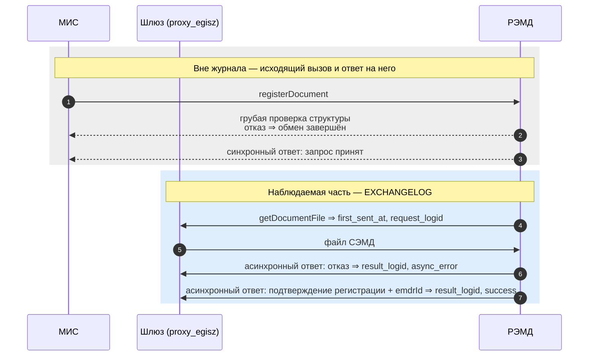
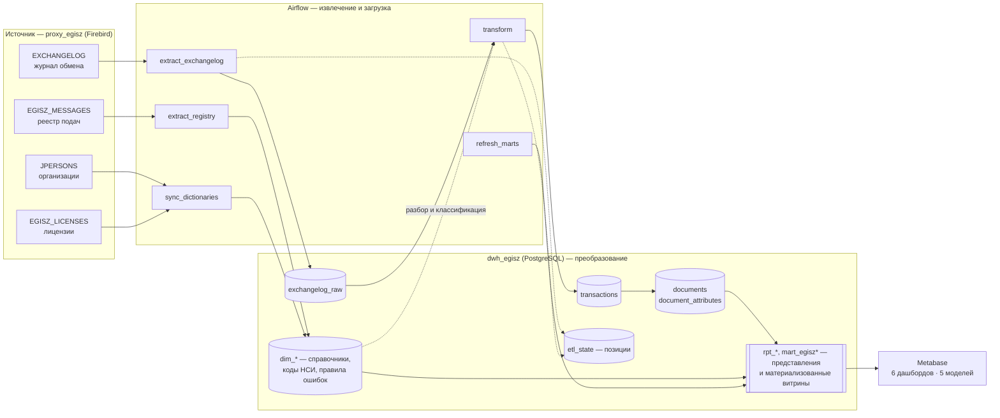
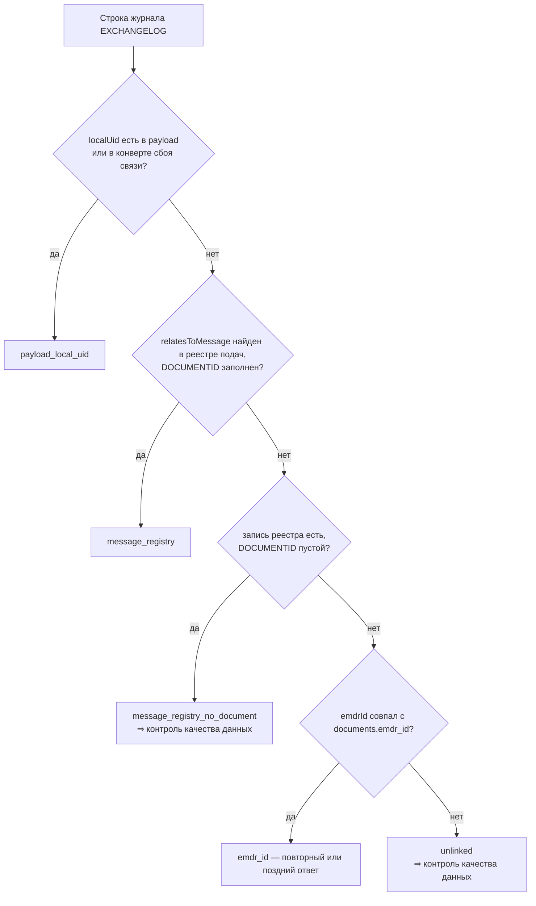
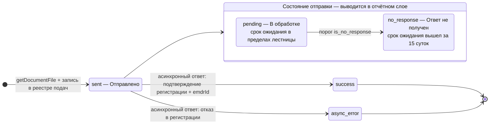
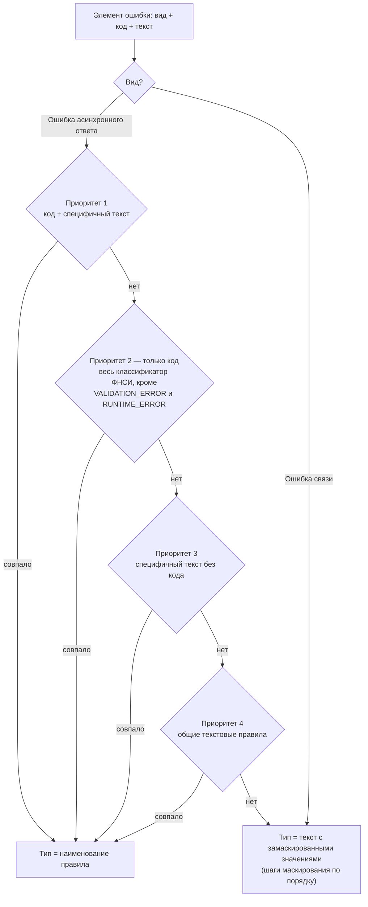

# Сервис эксплуатационной аналитики обмена с ЕГИСЗ

Сервис эксплуатационной аналитики обрабатывает журнал обмена с ЕГИСЗ: принимает сообщения шлюза, разбирает SOAP/XML, собирает в DWH PostgreSQL разобранные сообщения и документы, формирует витрины и публикует отчёты в Metabase.

Репозиторий содержит Airflow DAG, SQL-модель DWH, правила разбора и классификации ошибок, JSON-дашборды Metabase и скрипты развёртывания.

## С чего начать

Разделы рассчитаны на разного читателя — начинать стоит со своего.

| Читатель | Задача | Маршрут |
| -------- | ------ | ------- |
| Дежурная поддержка | Понять, что происходит с обменом сейчас | [Работа с анализом отправки](#работа-с-анализом-отправки) → [Классификация ошибок](#классификация-ошибок) → [Запуск контуров](#запуск-контуров) |
| Аналитик | Построить или проверить отчёт | [Состав аналитики](#состав-аналитики) → [DWH-модель](#dwh-модель) → [Дашборды Metabase](#дашборды-metabase) |
| Разработчик конвейера | Изменить разбор или модель данных | [Архитектура и поток данных](#архитектура-и-поток-данных) → [Парсинг и нормализация](#парсинг-и-нормализация) → [Связывание сообщений](#связывание-сообщений) → [Сборка документа](#сборка-документа) |
| Тот, кто принимает систему | Понять предмет и границы достоверности | [Контекст](#контекст-егисз-сэмд-обмен-и-где-в-нём-наш-контур) → [Состав аналитики](#состав-аналитики) → [Управленческий дашборд](#управленческий-дашборд-05_executivejson) |

Остальные разделы: [Источник данных](#источник-данных), [ELT-конвейер](#elt-конвейер), [Версии и идентичность документа](#версии-и-идентичность-документа), [Глоссарий](#глоссарий), [Источники методологии](#источники-методологии). Перечень типов отказов и условия правил вынесены в [справочник ошибок](docs/error-catalog.md).

Локальные значения по умолчанию:

| Компонент | Адрес | База / ресурс | Учётка |
| --------- | ----- | ------------- | ------ |
| Firebird proxy | `localhost:3050` | `proxy_egisz` | `sysdba` / `masterkey` |
| PostgreSQL DWH | `localhost:5432` | `dwh_egisz` | `egisz` / `egisz` |
| Airflow UI/API | `http://localhost:8080` | namespace `egisz-bi` | задаётся контуром Airflow |
| Metabase | `http://localhost:3000` | коллекция `Интеграция с ЕГИСЗ` | `admin@egisz.local` / `egisz` |

---

## Контекст: ЕГИСЗ, СЭМД, обмен и где в нём наш контур

**ЕГИСЗ** — единая государственная информационная система в сфере здравоохранения. Для клиники ключевое взаимодействие — передача **СЭМД** (структурированных электронных медицинских документов) в **РЭМД** (реестр электронных медицинских документов).

Между МИС и ЕГИСЗ стоит проксирующий шлюз. Он пишет сообщения в журнальную БД **`proxy_egisz`** (Firebird). Сервис строит на её основе документную витрину для BI и оперативного контроля.

### Схема регистрации СЭМД и что из неё видит журнал

По методическому документу «Описание выполняемых проверок в РЭМД» регистрация состоит из одиннадцати шагов и включает два этапа проверки и два ответа — синхронный на приём запроса и асинхронный на результат. Асинхронный ответ содержит подтверждение регистрации СЭМД или сведения об отказе в регистрации.

Журнал шлюза видит не весь обмен. Он фиксирует входящие вызовы ЕГИСЗ→шлюз и сбои доставки. Доставленная подача и синхронный ответ на неё в журнале отсутствуют. Недоставленная подача (`registerDocument` с `LOGSTATE = 3`) в журнале есть: на 26.09.2026 на проде таких строк 176 558. Документ она не создаёт и хранится как ошибка связи разобранного сообщения.


```mermaid
sequenceDiagram
    autonumber
    participant МИС
    participant Шлюз as Шлюз (proxy_egisz)
    participant РЭМД

    rect rgb(238,238,238)
    note over МИС,РЭМД: Вне журнала — исходящий вызов и ответ на него
    МИС->>РЭМД: registerDocument
    РЭМД-->>МИС: грубая проверка структуры<br/>отказ ⇒ обмен завершён
    РЭМД-->>МИС: синхронный ответ: запрос принят
    end

    rect rgb(222,238,252)
    note over Шлюз,РЭМД: Наблюдаемая часть — EXCHANGELOG
    РЭМД->>Шлюз: getDocumentFile ⇒ first_sent_at, request_logid
    Шлюз->>РЭМД: файл СЭМД
    РЭМД->>Шлюз: асинхронный ответ: отказ ⇒ result_logid, async_error
    РЭМД->>Шлюз: асинхронный ответ: подтверждение регистрации + emdrId ⇒ result_logid, success
    end
```

Отсюда следуют два свойства модели данных.

**Первое наблюдаемое событие документа — запрос файла со стороны РЭМД.** Он выполняется уже после того, как запрос прошёл проверки первого этапа, и именно его момент попадает в `first_sent_at`. Дата подачи документа медицинской системой находится вне журнала.

**Синхронные отказы в отчётность не входят.** При отказе на первом этапе обмен завершается до запроса файла, и в журнале не остаётся ни одной строки. Доля успеха и объёмы считаются по событиям, представленным в журнале шлюза.

---

## Состав аналитики

Семь срезов эксплуатационной аналитики; каждый опирается на витрины DWH и вкладки дашборда «Интеграция с ЕГИСЗ» либо на отдельные клиентские дашборды.

| Срез | Содержание | Витрина / представление |
| ---- | ---------- | ----------------------- |
| Отправка и состояния | Объёмы, состояния, динамика по клиникам и типам СЭМД | `rpt_documents` |
| Обратная связь | Отправленные без ответа, корреляция подачи и ответа | `rpt_documents_sent`, `rpt_documents` |
| Ошибки | Вид, категория и тип ошибки, вклад клиник в изменение доли ошибок против опорного периода фазы, ошибки связи за скользящие сутки | `mart_egisz_selfservice.document_error`, `mart_egisz_selfservice.network_error`, `rpt_documents`, `dim_control_chart_phases` |
| Полнота | Атрибуты документа, `emdrId`, расхождения JID | `rpt_documents`, `document_attributes` |
| Версии | Текущая версия, полный аудит попыток, контроль группировки | `rpt_documents`, `rpt_document_versions`, `rpt_health_versions` |
| Недельная динамика | SLI по неделям, контрольная карта XmR с фазами, отказы РЭМД и ошибки связи раздельно, время до ответа РЭМД, новые подключения, структура ошибок по категориям | `rpt_documents_weekly`, `mart_egisz.agg_document_error_weekly`, `rpt_documents`, `dim_control_chart_phases` |
| Загрузка данных | Позиции выгрузки и разбора, необработанный raw, контрольные показатели | `rpt_health_*`, `etl_state` |

---

## Архитектура и поток данных

Схема **ELT**: Airflow извлекает и загружает данные, не меняя исходный журнал; PostgreSQL разбирает сообщения, нормализует реквизиты, собирает документы и классифицирует ошибки; Metabase читает готовые представления и витрины. Вся содержательная логика живёт в базе — конвейер остаётся тонким.


```mermaid
flowchart LR
    subgraph SRC["Источник — proxy_egisz (Firebird)"]
        EL[EXCHANGELOG<br/>журнал обмена]
        EM[EGISZ_MESSAGES<br/>реестр подач]
        JP[JPERSONS<br/>организации]
        LIC[EGISZ_LICENSES<br/>лицензии]
    end

    subgraph AF["Airflow — извлечение и загрузка"]
        T1[extract_exchangelog]
        T2[extract_registry]
        T3[sync_dictionaries]
        T4[transform]
        T5[refresh_marts]
    end

    subgraph DWH["dwh_egisz (PostgreSQL) — преобразование"]
        RAW[(exchangelog_raw)]
        TX[(transactions)]
        DOC[(documents<br/>document_attributes)]
        DIM[(dim_* — справочники,<br/>коды НСИ, правила ошибок)]
        RPT[[rpt_*, mart_egisz* — представления<br/>и материализованные витрины]]
        ST[(etl_state — позиции)]
    end

    MB[Metabase<br/>6 дашбордов · 5 моделей]

    EL --> T1 --> RAW
    EM --> T2 --> DIM
    JP --> T3 --> DIM
    LIC --> T3
    RAW --> T4 --> TX --> DOC
    DIM -. разбор и классификация .-> T4
    DOC --> RPT
    DIM --> RPT
    T5 --> RPT
    RPT --> MB
    T1 -.-> ST
    T4 -.-> ST
```

| Компонент | Роль |
| --------- | ---- |
| `proxy_egisz` (Firebird) | Журнал обмена, реестр подач и справочники — источник, доступ только на чтение |
| Airflow | Два DAG: приём и разбор журнала, суточное обслуживание |
| `dwh_egisz` (PostgreSQL) | Raw, разобранные сообщения, документы, справочники, правила ошибок, отчётный слой |
| Metabase | Шесть дашбордов и пять моделей поверх отчётного слоя |

Служебные базы Airflow и Metabase отделены от `dwh_egisz`.

---

## Источник данных

Инкрементальная выборка журнала — keyset-курсором по монотонному `EXCHANGELOG.LOGID`.

| Таблица | Детализация | Поля |
| ------- | ----- | ---- |
| `EXCHANGELOG` | 1 строка = 1 SOAP-сообщение | `LOGID`, `LOGDATE`, `CREATEDATE`, `MSGID`, `LOGSTATE`, `LOGTEXT`, `MSGTEXT`, `URI` |
| `EGISZ_MESSAGES` | 1 строка = 1 подача через IPS | `EGMID`, `MSGID`, `REPLYTO`, `DOCUMENTID`, `CREATEDATE` (момент внесения строки в таблицу прокси) |
| `JPERSONS` | Организация | `JID` (`bigint`), `JNAME`, `JINN`, `JADDR`, `FIR_OID` |
| `EGISZ_LICENSES` | Лицензия МО | `mo_uid` (регистрационный OID), `JID`, `MO_DOMEN` (адрес обмена, он же `REPLYTO` подачи) |

Основные поля журнала:

| Поле | Содержание |
| ---- | ---------- |
| `MSGTEXT` | Полный SOAP/XML: BLOB в источнике, `text` в DWH. Бизнес-поля извлекаются на этапе transform; исходный текст сообщения сохраняется без изменения |
| `LOGDATE` | Служебная метка строки журнала |
| `CREATEDATE` | Дата обработки сообщения транспортом IPS |
| `URI` | Подсистема ЕГИСЗ: `/emdr/callback` — РЭМД, `/ips/callback` — ИЭМК |

`EGISZ_MESSAGES` хранит реестр подач IPS. `MSGID` содержит идентификатор исходящего сообщения, `REPLYTO` — endpoint клиники, `DOCUMENTID` — localUid для РЭМД. Для ИЭМК связь ответа с подачей строится по `MSGID`; `document_uid` не заполняется.

`EXCHANGELOG` содержит входящие вызовы ЕГИСЗ→шлюз. Исходящий `registerDocument` и синхронный ответ на него находятся вне этой таблицы; связь асинхронного ответа с документом строится через `dim_message_document` (см. §«Связывание сообщений»).

Правила выборки:

| Объект | Курсор | Условие |
| ------ | ------ | ------- |
| `EXCHANGELOG` | `LOGID` | keyset-выборка по монотонному идентификатору |
| `EGISZ_MESSAGES` | `EGMID` | keyset-выборка без отбора по `MSGID` и `DOCUMENTID` |
| Окно приёма | `CREATEDATE` | нижняя граница задаётся `EGISZ_EXTRACT_DEPTH_DAYS`, по умолчанию 30 суток |

Для `EXCHANGELOG` каждая страница выбирается на источнике только по курсору: `LOGID > текущий курсор`, сортировка по `LOGID`, ограничение размера страницы. Отбор по `CREATEDATE` на источнике не выполняется (поле не проиндексировано), поиск `MIN(LOGID)` по журналу тоже. Окно приёма (по умолчанию 30 суток, `EGISZ_EXTRACT_DEPTH_DAYS`) применяется к уже прочитанной странице: строки старше окна в raw не попадают, но курсор проходит через них; внутри окна курсор останавливается перед разрывом `LOGID` (см. «Непрерывный участок журнала»). Для `EGISZ_MESSAGES` сохраняется подъём отметки к границе окна через `MIN(EGMID) WHERE CREATEDATE >= ?`, если дата следующей строки ещё ниже окна. Настройки описаны в deploy/README.md §«Настройки DAG».

В отчётность входят асинхронные ответы, ошибки связи и запросы файла, которые зафиксированы в журнальных таблицах шлюза.

---

## ELT-конвейер

Два DAG: приём и разбор журнала, суточное обслуживание. У каждого `max_active_runs = 1`.

### `egisz_etl_dag` — каждые 5 минут

| Задача | Действие |
| ------ | -------- |
| `extract_exchangelog` | `EXCHANGELOG` → `exchangelog_raw` по курсору журнала |
| `extract_registry` | `EGISZ_MESSAGES` → `dim_message_document` по курсору реестра |
| `sync_dictionaries` | `JPERSONS` → `dim_organizations`, `EGISZ_LICENSES` → `dim_licenses`; при изменениях пересчитывает JID документов |
| `transform` | Разбор сообщений журнала: исход асинхронного ответа, элементы ошибки, записи по документам |
| `refresh_marts` | `REFRESH MATERIALIZED VIEW CONCURRENTLY` по шести витринам. Порядок обязателен: первой обновляется `stg_egisz.document_error_current`, её читают витрина ошибок документа, недельный и месячный слои |

### `egisz_maintenance_dag` — раз в сутки

| Задача | Действие |
| ------ | -------- |
| `consistency_check` | Сверка полноты журнала за последние 7 суток; недостающие строки догружаются и разбираются |
| `maintain_partitions` | Создание месячных партиций на предстоящий период |
| `reclassify_errors` | Пересчёт ошибок по текущим правилам: `reclassify_error_details()` и обновление витрин. Запускается вручную параметром `reclassify_errors`, суточный прогон задачу пропускает. На время пересчёта `egisz_etl_dag` ставится на паузу |

Полных пересчётов документов в регламенте нет: атрибуты документа и группы версий поддерживаются инкрементально в конце каждого `transform`. Правила ошибок меняются правкой `db/02_functions.sql`; после применения схемы элементы ошибки приводит к новым правилам задача `reclassify_errors`.

Сетка партиций привязана к полуночи UTC, а не к началу месяца по календарю отчётности: якорь границы обязан быть константой контура, иначе месяцы, созданные из разных сессий, перестают стыковаться. Смещение относительно отчётного календаря влияет только на отсечение партиций и в разметке периодов не участвует.

### Правила выполнения

**Раздельные позиции выгрузки и разбора.** Выгрузка ведёт свою позицию в журнале шлюза, разбор — свою в raw. Отставание разбора хранится в позиции raw; позиция выгрузки остаётся подтверждённой точкой журнала. Объём необработанного raw рассчитывается по данным самой таблицы.

**Непрерывный участок журнала.** Журнал нумеруется подряд, поэтому пропуск `LOGID` внутри окна приёма означает строку в процессе коммита на источнике. Позиция выгрузки устанавливается перед разрывом и продвигается после появления строки; строки страницы загружаются целиком. Строки старше окна в raw не попадают, и позиция проходит через них вместе с пропусками среди них: непрерывность проверяется, начиная с первой строки окна. Принадлежность самой позиции окну определяется по наличию её строки в raw. Разбор ограничен позицией выгрузки: в разобранные сообщения попадает подтверждённо вычитанный участок журнала.

**Пересчёт документов.** Батч `transform` пересчитывает реквизиты и версии затронутых документов. При изменении справочников организаций или лицензий DAG заново определяет сохранённый `documents.jid` по `documents.org_oid` и host-пути; витрины обновляются в конце цикла.

**Сбой подключения к источнику.** Задачи, обращающиеся к шлюзу, повторяются дважды с минутной паузой. Последующие шаги используют состояние конвейера, разбирают уже загруженный raw и обновляют витрины.

**Повторный запуск.** Загрузка идемпотентна, строка журнала в источнике остаётся неизменной, повторный разбор пропускает уже обработанные строки. Позиции обновляются только после успешного шага; следующий запуск продолжает с последней подтверждённой точки. Уникальные ключи предотвращают дубли документов.

---

## Парсинг и нормализация

Каждая строка `exchangelog_raw` парсится один раз функцией `parse_exchangelog_row(msgtext, msgid, logtext)`.

| Этап | Что фиксируется |
| ---- | --------------- |
| Разбор XML | Результат записывается в `transactions` (`xml_*`) |
| Маркер попытки | LOGID попадает в узкую таблицу `exchangelog_parse_attempts` |
| Строки без реквизитов | `msgid`/`localUid`/`emdrId`/`getDocumentFile` не найдены; строка получает маркер попытки и остаётся вне `transactions` |
| Дальнейшая сборка | Читает только `transactions`, поэтому широкое окно проверки полноты не разбирает уже просмотренные строки повторно |

Утилиты (`db/02_functions.sql`):

| Функция | Назначение |
| ------- | ---------- |
| `xml_text` | Текст тега XML без привязки к namespace |
| `normalize_message_id` | `urn:uuid:` → единый формат |
| `message_registry_key` | Нормализованный ключ реестра подач: без дефисов, без префикса, в верхнем регистре |
| `dwh_id` | Ключ **экземпляра/версии** документа: `lower(localUid)` (см. §«Версии и идентичность документа») |
| `egisz_subsystem` | Подсистема ЕГИСЗ (РЭМД/ИЭМК) по `URI` вызова |
| `resolve_document_jid` | JID: `org_oid` из XML → `dim_organizations.fir_oid`; резервно по host/gost-endpoint |
| `normalize_semd_code` | Код СЭМД из payload |
| `classify_async_status` | Исход асинхронного ответа: `success`, `error` или пусто |
| `stg_egisz.error_items` | Элементы ошибки сообщения: ошибка связи при `LOGSTATE = 3` и элементы асинхронного ответа |
| `stg_egisz.classify_error` | Тип элемента по справочнику правил: классификация или маскирование значений |

Извлекаемые поля:

| Поле | Источник | Правило |
| ---- | -------- | ------- |
| `msgid` | `<messageId>` / `MSGID` | Собственный MSGID текущего сообщения |
| `relates_to_msgid` | `<relatesToMessage>` / `<relatesTo>` | Связанный MSGID из XML; используется для поиска подачи в `dim_message_document` |
| Локальный ID РЭМД | `<localUid>` / `DOCUMENTID` | `DOCUMENTID` не применяется к ИЭМК |
| ID в РЭМД | `<emdrId>` | |
| OID организации | `<organization>` | → `dim_clinic_oid` → JID (см. ниже) |
| Код / название СЭМД | `<kind>`, `<name>` | Название также из `dim_semd_types` (НСИ `1.2.643.5.1.13.13.11.1520`); там же `ig_oid` — OID руководства по реализации, который выгрузка ФНСИ кладёт в поле `GIT_LINK`, а ссылку на портал — в `IMPLEMENTATION_GUIDE` |
| Элементы ошибки | `<item>` (`<code>`, `<message>`), `RegistryError` ИЭМК; при `LOGSTATE = 3` — `LOGTEXT` | → `transactions.error_details` (см. §«Классификация ошибок») |
| Дата создания | `<creationDateTime>` | `safe_cast_timestamptz` |
| Номер протокола | `<documentNumber>` / `PROTOCOLID` | → `doc_number`; ключ группировки версий (см. §«Версии и идентичность документа») |

Разбор различает два уровня. **Исход асинхронного ответа** относится к одному сообщению журнала, **статус документа** — итог по цепочке сообщений одной подачи.

**Исход асинхронного ответа** (`classify_async_status`) определяется только для асинхронного ответа: `sendRegisterDocumentResult` РЭМД и `ProvideAndRegisterDocumentSet-bAsyncResponse` ИЭМК. Значения — `success` и `error`. У РЭМД успех — «Зарегистрировано» в `<documentStatus>` или статус `ok`/`success`; отказ — статус с признаком ошибки или SOAP Fault. У ИЭМК исход берётся из `ResponseStatusType`: `Success` — успех, `Failure` и `PartialSuccess` — отказ. `LOGSTATE` на исход не влияет. Запрос, синхронный ответ и нераспознанный асинхронный ответ исхода не получают; нераспознанные ответы видны сигналом `unrecognized_async_responses` в `rpt_health_signals`.

**Статус документа** в `documents` — три значения справочника `dim_document_status`:

| `status` | Метка | LOGID-якорь | MSGID-якорь |
| --- | --- | --- | --- |
| `sent` | **Отправлено**: файл запрошен РЭМД, подача подтверждена реестром, асинхронного ответа ещё нет | `request_logid` | `msgid` |
| `success` | **Успешно зарегистрирован** | `result_logid` | `msgid` / `relates_to_msgid` |
| `async_error` | **Ошибка асинхронного ответа РЭМД** | `result_logid` | `msgid` / `relates_to_msgid` |

Статус меняет только асинхронный ответ, доставлен он в МИС или нет. Ошибка связи хранится рядом со статусом и его не меняет (см. §«[Классификация ошибок](#классификация-ошибок)»). Элементы ошибки в успешном асинхронном ответе сохраняются, но документ остаётся «Успешно зарегистрирован»: приоритет у статуса и регистрационного номера.

Единственное нефинальное состояние — `sent`; его код задан в справочнике и читается функцией `document_status_nonfinal()`, ветви `transform_raw_to_facts` берут значение оттуда. В отчётном слое `sent` дополнительно раскрывается сроком ожидания и состоянием отправки — см. §«[Учёт отправленных](#учёт-отправленных)».

Транспортные реквизиты именуются по записям журнала: **запрос файла** = `request_*`, **исход** (асинхронный ответ) = `result_*`. В витрине `logid = COALESCE(result_logid, request_logid)` — у отправленных без ответа это LOGID запроса файла.

**Разрешение ЮЛ** выполняет `resolve_document_jid(org_oid, endpoint)` в два шага:

1. **OID медорганизации из содержания обмена** — реестр `dim_clinic_oid` над `dim_organizations.fir_oid`. Основной путь: OID принадлежит документу, а не транспорту.
2. **Адрес обмена** `gost-<N>` (`REPLY_TO` подачи = `MO_DOMEN` лицензии) — резерв для строк, где OID не разрешился.

Применённый шаг пишется в `resolve_method` (`mo_uid` / `host`). Признак `clinic_oid_unknown` означает, что OID из обмена в реестре организаций отсутствует.

Сам `fir_oid` имеет два источника: ведущий — справочник ФРМО (НСИ 1461), дополняющий — `JPERSONS.FIR_OID` из базы юридических лиц компании. Синхронизация справочников закрывает пробелы и никогда не затирает уже известный OID пустым значением.

---

## Связывание сообщений

Журнал шлюза содержит входящие вызовы ЕГИСЗ→шлюз. Исходящее сообщение, которым IPS подаёт документ (`registerDocument` в РЭМД, `ProvideAndRegisterDocumentSet-b` в ИЭМК), хранится в реестре подач. Асинхронный ответ содержит `relatesToMessage` / `relatesTo`, ссылающийся на подачу; связь ответа с документом строится через `dim_message_document`.

| Уровень | Ключ | Источник |
| ------- | ---- | -------- |
| Сообщение журнала | `logid` | `EXCHANGELOG` |
| Подача документа (попытка) | `msgid` | `EGISZ_MESSAGES` → `dim_message_document` |
| Экземпляр документа РЭМД | `dwh_id` = `lower(localUid)` | `DOCUMENTID` реестра либо payload запроса |
| Логический документ | `document_group_id` | `jid` + `semd_code` + `doc_number` |

`msgid → document_uid` однозначен; на один документ приходится несколько `msgid` — по одному на попытку подачи. Число подач хранится в `documents.attempt_count` и выводится на вкладке «Отправленные».

Правила привязки проверяются по порядку; первое сработавшее определяет `transactions.link_method`.


```mermaid
flowchart TD
    M["Строка журнала EXCHANGELOG"] --> Q1{"localUid есть в payload<br/>или в конверте сбоя связи?"}
    Q1 -->|да| L1["payload_local_uid"]
    Q1 -->|нет| Q2{"relatesToMessage найден в реестре подач,<br/>DOCUMENTID заполнен?"}
    Q2 -->|да| L2["message_registry"]
    Q2 -->|нет| Q3{"запись реестра есть,<br/>DOCUMENTID пустой?"}
    Q3 -->|да| L3["message_registry_no_document<br/>⇒ контроль качества данных"]
    Q3 -->|нет| Q4{"emdrId совпал с documents.emdr_id?"}
    Q4 -->|да| L4["emdr_id — повторный или поздний ответ"]
    Q4 -->|нет| L5["unlinked<br/>⇒ контроль качества данных"]
```

Для контура ИЭМК ключом реестра служит `msgid` подачи: `document_uid` там не заполняется.

Две метки означают потерю связи исхода с документом и выводятся в `rpt_health_signals`. `message_registry_no_document` — ответ, связанный с записью реестра без `DOCUMENTID`. `unlinked` — ответ, для которого записи в реестре нет вовсе. Доля считается по последним 500 размеченным ответам **в порядке LOGID**: окно следует порядку журнала независимо от времени приёма, поэтому не пустеет при неровном темпе загрузки.

Ответ может создать запись в `documents` до события отправки: ЕГИСЗ отклоняет часть документов до запроса файла, и наблюдаемым событием остаётся сам ответ.

Окно разбора строго `(from_logid, to_logid]`: связывание опирается на строки текущего батча, поэтому отсечение партиций по `createdate` работает на каждом запуске.

---

## Сборка документа

Три уровня сборки:

| Уровень | Объект | Что происходит |
| ------- | ------ | -------------- |
| Сообщение | `transactions` | `transform_raw_to_facts` разбирает новые строки `exchangelog_raw`: поля `xml_*`, исход асинхронного ответа, элементы ошибки, `jid` для `getDocumentFile` |
| Экземпляр документа | `documents` | UPSERT по `dwh_id = lower(localUid)`; строки одной отправки сходятся в запись по правилам из §«Связывание сообщений» |
| Группа версий | `document_group_id` | `recompute_document_versions(dwh_ids)` пересчитывает цепочку `supersedes_*` и флаг `is_current_version` для батча и соседей по группе |

На уровне `documents` накапливаются `first_sent_at`, `last_callback_at`, `registered_at`, `attempt_count`, итоговый `status`, `jid`. Ошибки документа в `documents` не хранятся: они остаются элементами разобранных сообщений (см. §«Классификация ошибок»). Уровень записи — **версия отправки**: правка СЭМД меняет `localUid` и создаёт новый экземпляр (см. §«Версии и идентичность документа»).

Повторный разбор той же строки пропускается по маркеру `exchangelog_parse_attempts`. Маркер пишется на весь просканированный диапазон, включая отфильтрованные строки. Для `getDocumentFile` JID определяется один раз за жизнь строки: `resolve_document_jid` вызывается при разборе, без повторного чтения payload регулярным выражением.

Пересчёт групп версий вызывается в конце `transform_raw_to_facts` — для документов батча и их соседей по группе. Отдельного полного прохода в регламенте нет: он нужен только при первичном наполнении отчётного слоя на существующий архив и выполняется накатом схемы.

Разделение LOGID документа: `request_logid` — запрос файла (`getDocumentFile`), `result_logid` — последний асинхронный ответ. `msgid` — собственный MSGID текущего события документа; `relates_to_msgid` заполняется только из XML `relatesToMessage` / `relatesTo`.

`document_attributes` (1:1 к экземпляру): OID происхождения, host, endpoint, `egisz_subsystem` (последнее непустое значение по строкам документа), BI-маски. Обновляется инкрементально в конце `transform_raw_to_facts` по документам батча.

### Учёт отправленных

`status = 'sent'` означает, что файл запрошен РЭМД, подача подтверждена строкой `EGISZ_MESSAGES`, а ответ ещё не пришёл.

| Ситуация | Как учитывается |
| -------- | --------------- |
| `getDocumentFile` + запись в `EGISZ_MESSAGES` | Документ попадает в состояние отправки |
| `getDocumentFile` без строки реестра | Остаётся транспортной диагностикой и не создаёт `sent` |
| `getDocumentFile` с заполненным `emdrId` | Запрос файла уже зарегистрированного ЭМД: повторной отправки нет, документ не создаётся и к документу не привязывается. Такие строки уходят в `rpt_document_file_request` и на дашборд «История запроса документов» |

В отчётном слое `sent` раскрывается **сроком ожидания** и **состоянием отправки**. Оба выводятся на чтении и в `documents` не хранятся.


```mermaid
stateDiagram-v2
    direction LR
    [*] --> sent: getDocumentFile + запись в реестре подач

    state "sent — Отправлено" as sent
    state "Состояние отправки — выводится в отчётном слое" as detail {
        direction LR
        pending: pending — В обработке<br/>срок ожидания в пределах лестницы
        no_response: no_response — Ответ не получен<br/>срок ожидания вышел за 15 суток
        pending --> no_response: порог is_no_response
    }

    sent --> detail
    sent --> success: асинхронный ответ: подтверждение регистрации + emdrId
    sent --> async_error: асинхронный ответ: отказ в регистрации

    success --> [*]
    async_error --> [*]
```

**Отдельной таблицы снимков очереди нет.** Состояние на любой момент — прошлый или текущий — восстанавливается из двух отметок документа теми же двумя функциями DWH:

| Свойство | Определение | Функция |
| -------- | ----------- | ------- |
| Членство в очереди | документ отправлен не позже момента (`first_sent_at <= момент`), а первый ответ к этому моменту ещё не пришёл: `first_callback_at IS NULL` либо `first_callback_at > момент` | `is_pending_at(first_sent_at, first_callback_at, момент)` |
| Возраст | `момент - first_sent_at` | — |
| Срок ожидания | первая строка справочника по `sort_order`, чья `max_age_minutes` покрывает возраст; терминальная (`NULL`) замыкает лестницу | `pending_segment_code_at(first_sent_at, момент)` |

Границу выхода из очереди задаёт отметка **первого** ответа. `delivery_seconds` для этого непригоден: он меряет срок до последнего ответа и растягивается каждым повторным callback — его дело карточки времени доставки.

Момент подставляет потребитель:

| Потребитель | Момент |
| ----------- | ------ |
| `rpt_documents`, `rpt_documents_sent` | `now()` — очередь на момент чтения |
| `rpt_documents_weekly` / `rpt_documents_monthly` | конец своей недели или месяца, для открытого периода — `now()`; строки закрытого периода не меняются между обновлениями витрин |
| Карточки очереди на дашбордах | `now()`; фильтр периода к состоянию на момент неприменим и в наименованиях карточек оговорён как «(без фильтра периода)» |

**Лестница сроков ожидания** — справочник `dim_pending_segments`, возраст отсчитывается от `first_sent_at`:

| Срок ожидания | Граница | Состояние |
| ------- | ------- | --------- |
| до 5 минут · до 1 часа · до 6 часов · до 12 часов · до 24 часов · до 3 суток · до 7 суток · до 15 суток | `max_age_minutes` (5 … 21600) | `pending` — **В обработке** |
| свыше 15 суток | терминальная (`NULL`) | `no_response` — **Ответ не получен (утилизирован)** |

Точка перехода задаётся флагом `is_no_response`. Ужесточение порога выполняется `UPDATE` по справочнику — без правки SQL и без пересчёта документов. Отправки без известного `first_sent_at` попадают на терминальный срок.

**Набор документов очереди един для всех карточек**: документ отправлен, первого ответа на момент нет, срок ожидания в пределах лестницы. Документы за терминальным порогом в очередь не входят нигде — им посвящена отдельная пара карточек.

**Полнота данных во времени.** Курсоры `etl_state` идут по `LOGID` журнала, а не по времени события, поэтому по ним нельзя судить о свежести. Её показывает отдельный сигнал `data_freshness` («Свежесть данных (последнее событие документа)», `rpt_health_signals`): возраст самого нового события в `documents` — `now()` минус максимум по `last_callback_at`, `first_sent_at` и дате создания документа. Срез очереди за период читается вместе с этим сигналом.

**Правило отображения:**

| Состояние | Цвет | Где учитывается |
| --------- | ---- | --------------- |
| **В обработке** (`pending`) | светло-синий | Наравне с исходами: распределения статусов, объёмы, динамика |
| **Ответ не получен (утилизирован)** (`no_response`) | светло-серый | Только вкладка «Отправленные» |

`status_detail` — единое измерение из пяти значений (три исхода + два состояния отправки); карточки распределений отбирают по нему условием `status_detail <> 'no_response'`.

**Знаменатели долей.** «% успеха» и «% ошибок» считаются по документам с ответом:

```
доля успеха = success / (success + async_error)
```

`pending` — состояние ожидания; метрики отношения отбирают по `status <> 'sent'`. Распределения и счётчики объёма учитывают текущие состояния отправки.

Документы с ответом также включают отказы ЕГИСЗ до запроса файла: для них наблюдаемым событием является асинхронный ответ, который создаёт запись (см. §«Связывание сообщений»).

---

## Версии и идентичность документа

Журнал хранит SOAP-обёртку РЭМД; тело CDA (base64) находится вне контракта журнала. Парсер извлекает из обёртки `localUid`, `documentNumber`, `emdrId`, корреляционные MSGID. Поля CDA `setId` / `versionNumber` / `relatedDocument` в `MSGTEXT` отсутствуют.

| Уровень | Смысл | Источник в обёртке | Поле DWH |
| ------- | ----- | ------------------ | -------- |
| Экземпляр / версия | UUID конкретной выгрузки СЭМД; меняется при правке и перевыгрузке | `localUid` | `dwh_id` (PK) |
| Логический документ | Цепочка версий одного документа в МИС | `jid` + `semd_code` + `doc_number` | `document_group_id` |

`doc_number` — номер протокола/ИБ (`PROTOCOLID` / тег `documentNumber`), подтягивается из `transactions` в `documents` на шаге группировки. Экземпляры без `documentNumber` остаются одиночными группами (`singleton`).

Логика `recompute_document_versions` (`db/03_transform.sql`):

| Условие | `document_group_id` | `document_group_confidence` | Группа версий |
| ------- | ------------------- | --------------------------- | ------------- |
| Нет `jid`, `semd_code` или `doc_number` | `dwh_id` | `singleton` | нет (экземпляр сам себе группа) |
| Ключ заполнен, в группе 1 экземпляр | `dwh_id` | `singleton` | нет |
| Ключ заполнен, 2…50 экземпляров (`c_cap`) | `grp_key` из `recompute_document_versions` | `doc_number` | да |
| Ключ заполнен, > 50 экземпляров | `dwh_id` | `singleton` | нет (защита от переиспользования счётчика протокола) |

В реальной группе: `semd_version_number` — порядок по `first_sent_at`; `is_current_version = true` ровно у одного экземпляра (`success`, иначе последнее IPS-событие); связь версий — `supersedes_dwh_id` / `superseded_by_dwh_id`.

Витрины: `rpt_documents` — только `is_current_version`; полный аудит — `rpt_document_versions`; контроль группировки — `rpt_health_versions` (размер групп, коллизии `localUid` по `transactions`).

---

## Классификация ошибок

Ошибка в отчётности описывается двумя полями: `error_text` — исходный текст без обработки, `error_type` — тип ошибки. Тип — нормализованная формулировка: ей соответствуют все сообщения, которые различаются только значениями документа. Правила хранятся в `mart_egisz.dim_error_rules`, функции — в `db/02_functions.sql`.

### Вид, категория, тип

**Вид ошибки** выделяет ошибки по уровню, на котором их зафиксировали.

| Вид | Когда возникает | Код | Внутри вида |
| --- | --------------- | --- | ----------- |
| Ошибка связи | Шлюз не доставил сообщение: `LOGSTATE = 3` | Код сокета Windows или HTTP из текста шлюза (`Socket error N`, `Error code: N`) | Сразу типы, без категорий |
| Ошибка асинхронного ответа | Элемент асинхронного ответа: `<item>` РЭМД (`code` + `message`) или `RegistryError` ИЭМК (`errorCode` + `codeContext`) | Мнемоника НСИ 305 или код IHE XDS | Категории, в них типы |

**Категория** — группа типов с общей причиной: данные пациента, данные медработника, ЭП и сертификаты, справочники НСИ и другие. Перечень и зоны ответственности — в [справочнике ошибок](docs/error-catalog.md).

Контур обмена (РЭМД или ИЭМК) — атрибут сообщения (`egisz_subsystem`), а не уровень классификации.

Одно сообщение может нести ошибки обоих видов. Асинхронный ответ с отказом, который шлюз не доставил в МИС, даёт ошибку связи и элементы отказа: это ошибки разных уровней, и одна не заменяет другую.

### Где хранятся ошибки

| Объект | Строка | Назначение |
| ------ | ------ | ---------- |
| `transactions.error_details` | JSON-массив элементов разобранного сообщения: `item_no`, `error_kind`, `error_code`, `error_text`, `error_type`, `nsi_dictionary_oid` | Заполняется при разборе один раз. Ошибка связи — элемент `item_no = 0` |
| `stg_egisz.document_error_current` | Ошибка текущего состояния документа | Элементы последнего асинхронного ответа документа и ошибки связи после него, с `error_text`. Отбор по документу и времени сообщения |
| `stg_egisz.message_error` | Элемент ошибки сообщения по времени сообщения | Все элементы всех разобранных сообщений, в том числе без связи с документом, с `error_text` |
| `mart_egisz_selfservice.document_error` | Ошибка текущего состояния документа с реквизитами документа | Вид, категория, тип, код, наименование по НСИ 305, справочник НСИ, зона ответственности, повторяемость, статус документа; без `error_text` |
| `mart_egisz_selfservice.network_error` | Ошибка связи по времени сообщения | Все ошибки связи, в том числе в сообщениях без связи с документом (`dwh_id` пуст); LOGID и MSGID сообщения, подпись СЭМД; без `error_text` |
| `mart_egisz.agg_document_error_weekly` / `_monthly` | Период × клиника × вид × категория | Число документов с ошибкой; документ учитывается в каждой своей категории |

В `documents` ошибок нет: статус документа определяет асинхронный ответ, а ошибки остаются элементами сообщений.

Исходный текст `error_text` в опубликованный слой не выносится: корпоративный стандарт хранилища (§2) не допускает там свободные тексты, в которых бывают персональные данные. Он остаётся в слое разбора, и дашборды до решения о доступе читают его из `stg_egisz.document_error_current` (ключ `dwh_id` + `error_no` общий с `document_error`) и `stg_egisz.message_error` (сообщение `logid` + `message_at` общее с `network_error`: ошибка связи у сообщения одна) — по исключению из правил стандарта.

### Справочники

| Справочник | Содержание |
| ---------- | ---------- |
| `mart_egisz.dim_nsi_error_code` | НСИ «РЭМД. Классификатор кодов сообщений» (OID `1.2.643.5.1.13.13.99.2.305`, версия 3.18): мнемоника и описание дословно |
| `mart_egisz.dim_nsi_error_code_alias` | Написания, которыми РЭМД отвечает вместо справочных (`RECIPIENT_*` вместо `RECEPIENT_*`); синоним разрешается до сопоставления |
| `mart_egisz.dim_error_rules` | Правила двух назначений: классификация (приоритет, код, шаблон текста → тип и категория) и маскирование (шаг с порядком применения, шаблон и замена) |
| `mart_egisz.dim_error_category` | Вид и категория → зона ответственности и повторяемость по умолчанию |
| `mart_egisz.dim_error_type` | Одна строка на тип: вид, категория, код НСИ, правило, зона ответственности (`клиника` / `МИС` / `интегратор` / `РЭМД` / `смешанная`), повторяемость (`is_retryable`) |

Типы правил заводит применение схемы. Тип без правила заводит разбор при первом появлении: для асинхронного ответа — с категорией «Прочие», для ошибки связи — без категории.

### Порядок сопоставления

Разбор выполняют две функции. `stg_egisz.error_items` извлекает элементы сообщения: ошибку связи при `LOGSTATE = 3` и элементы асинхронного ответа. `stg_egisz.classify_error` определяет тип элемента по справочнику правил.


```mermaid
flowchart TD
    A["Элемент ошибки: вид + код + текст"] --> K{"Вид?"}
    K -->|Ошибка асинхронного ответа| P1
    K -->|Ошибка связи| M

    P1{"Приоритет 1<br/>код + специфичный текст"} -->|совпало| OUT
    P1 -->|нет| P2
    P2{"Приоритет 2 — только код<br/>весь классификатор ФНСИ, кроме<br/>VALIDATION_ERROR и RUNTIME_ERROR"} -->|совпало| OUT
    P2 -->|нет| P3
    P3{"Приоритет 3<br/>специфичный текст без кода"} -->|совпало| OUT
    P3 -->|нет| P4
    P4{"Приоритет 4<br/>общие текстовые правила"} -->|совпало| OUT
    P4 -->|нет| M

    OUT["Тип = наименование правила"]
    M["Тип = текст с замаскированными значениями<br/>(шаги маскирования по порядку)"]
```

**Классификация.** Приоритеты проверяются по порядку; внутри приоритета побеждает правило с наименьшим кодом. У элемента ровно один тип. Приоритет 2 не курируется вручную: правило выводится из `dim_nsi_error_code` для каждой мнемоники, поэтому код вне НСИ завести нельзя. Мнемоники `VALIDATION_ERROR` («Ошибка валидации значения») и `RUNTIME_ERROR` («Непредвиденная ошибка») исключены: их описания диагностики не несут, и сплошное правило закрыло бы уточняющие приоритеты.

Уточняющие правила приоритетов 1 и 3 построены по методической документации «Описание выполняемых проверок в РЭМД»: кросс-валидация запроса и СЭМД (§5.2–5.5), валидация даты и последовательности подписей (§4.8–4.9), классы ошибок схематрона (§5.8), валидация по XSD (§5.7).

**Маскирование.** Если правило не найдено, тип — исходный текст, в котором значения документа заменены обозначениями. Шаги маскирования — строки справочника правил с порядком применения; шаг действует на свой вид или на оба. Сначала снимается служебная обёртка: у ИЭМК — коды `[CRE-…]: PAT-…;` и хвост `Patient(…)`, у ФРМСС `[code: …, description: …]` раскрывается в «Ошибки валидации в ФРМСС (код): описание». Затем значения в скобках и кавычках, даты, ФИО со СНИЛС, e-mail, OID, длинные номера и номер правила схематрона заменяются обозначениями (`[…]`, `<e-mail>`, `<oid>`, `<значение>`, `<правило>`), хвосты `Путь: /ClinicalDocument…` и реквизиты сертификата отрезаются. Наименование реквизита в «Указанное значение [Имя пациента] …» сохраняется. У ошибки связи маскируются адреса: `<endpoint>`, `<gost-endpoint>`, `<ip>`.

Годится ли текст в тип, решают при пополнении правил, а не при разборе. Ошибка без правила видна сигналом `uncovered_error_types` («Отказы без правила классификации») в `rpt_health_signals`; по нему заводится новое правило.

**Справочник НСИ элемента.** Для ошибок справочников OID извлекается шаблоном правила (`nsi_dictionary_pattern`) из текста конкретного элемента. Наименование берётся из `dim_nsi_dictionary`; справочник вне НСИ 805 показывается своим OID.

### Смена правил

Правила меняются правкой `db/02_functions.sql` и применением схемы. Элементы, уже сохранённые в `transactions.error_details`, приводит к новым правилам задача `reclassify_errors` в `egisz_maintenance_dag`. Функция `reclassify_error_details()` пересчитывает тип каждого уникального сочетания «вид — код — текст», заводит новые типы и удаляет типы без правила, на которые больше нет ссылок; затем задача обновляет витрины. Версий классификации нет: история всегда в текущих правилах.

Нарушения видны сигналами `rpt_health_signals`:

| Сигнал | Что означает |
| ------ | ------------ |
| `untyped_errors` | Элемент ошибки без типа или с типом вне справочника: элементы не приведены к текущим правилам |
| `unrecognized_async_responses` | Асинхронный ответ за последние сутки, исход которого не распознан |
| `uncovered_error_types` | Документы с ошибкой асинхронного ответа без правила классификации |

Перечень типов по категориям и условия всех правил — [справочник ошибок](docs/error-catalog.md).

### Подсистема ЕГИСЗ

`transactions.egisz_subsystem` (`РЭМД`/`ИЭМК`/NULL) вычисляется функцией `egisz_subsystem()`.

| Признак | Значение |
| ------- | -------- |
| `URI = /emdr/callback` | РЭМД |
| `URI = /ips/callback` | ИЭМК |
| `wsa:Action` начинается с `urn:ihe:*` | ИЭМК |
| Другой непустой `wsa:Action` | РЭМД |
| Порт сервиса клиники в `LOGTEXT`: `:9921` / `:9945` | ИЭМК / РЭМД |

`URI` — первичный транспортный реквизит; он заполнен до разбора payload, включая ошибки связи без тела ответа. На уровне документа значение фиксируется в `document_attributes.egisz_subsystem` как последнее непустое по строкам документа.

---


## DWH-модель

БД `dwh_egisz`. Схема — идемпотентный прогон `db/dwh_init.sql` (модули `db/`). Объекты обработки ошибок разложены по слоям стандарта хранилища: данные разбора — `stg_egisz`, справочники и агрегаты — `mart_egisz`, витрины для самостоятельного анализа — `mart_egisz_selfservice`. Остальные объекты пока в `public`, план переноса — [раскладка схем](docs/dwh-schema-naming-migration.md).

| Слой | Объект | Детализация / назначение |
| ---- | ------ | ------------------ |
| Состояние | `etl_state` | Позиции выгрузки и разбора: по журналу шлюза, по реестру подач, по raw |
| Реестр подач | `dim_message_document` | одна строка `EGISZ_MESSAGES` по `EGMID`; `msgid` подачи, `document_uid` localUid РЭМД, `reply_to`; для ИЭМК `document_uid` пустой |
| Raw | `exchangelog_raw` | Строка журнала как в источнике |
| Разобранные сообщения | `transactions` | Строка журнала + `xml_*` (разбор один раз) + исход асинхронного ответа (`status`) + элементы ошибки (`error_details`) + `egisz_subsystem` (РЭМД/ИЭМК) + `link_method` (правило привязки); `loaded_at` — момент ELT-загрузки |
| Документы | `documents` | Один экземпляр/версия СЭМД — одна строка (`dwh_id`); логическая группа версий — `document_group_id`, см. §«Версии и идентичность документа» |
| Атрибуты | `document_attributes` | OID происхождения клиники, host, способ определения JID, маскированные ФИО и СНИЛС, `egisz_subsystem` (подсистема на уровне документа) |
| Справочники | `dim_organizations`, `dim_nsi_organization`, `dim_licenses`, `dim_semd_types` | Клиники CASH/JPERSONS, справочник НСИ 1461, лицензии, типы СЭМД |
| Руководства по реализации | `dim_nsi_semd_guide`, `dim_nsi_semd_guide_alias` | НСИ `1.2.643.5.1.13.13.99.2.638`: руководство (OID, редакция, наименование) и синонимы OID; наполняются `scripts/load_nsi_semd_guides.py` |
| Требования руководств | `dim_nsi_semd_guide_dictionary` | НСИ `1.2.643.5.1.13.13.99.2.805`: справочники НСИ, предписанные руководством; детализация (руководство, справочник) |
| Наименования справочников | `dim_nsi_dictionary` | Снимок НСИ `1.2.643.5.1.13.13.99.2.805` вер. 6.19 (465 записей): OID справочника → наименование дословно + краткая подпись `short_name`; даёт `nsi_dictionary_name` в `mart_egisz_selfservice.document_error`. Справочники вне 805 показываются без расшифровки |
| Реестры разрешения ЮЛ | `dim_clinic_oid`, `dim_clinic_endpoint` | Представления над справочниками: OID → ЮЛ (основной путь) и адрес обмена → ЮЛ (резервный) |
| Реестр OID руководств | `dim_semd_guide_oid` | Представление над справочниками: `published_oid` (`dim_nsi_semd_guide.oid` либо `dim_nsi_semd_guide_alias.alias_oid`) → `guide_oid` (`dim_nsi_semd_guide.oid`). Точка входа — `dim_semd_types.ig_oid` |
| Состояния | `dim_document_status`, `dim_pending_segments`, `dim_sent_state` | Статусы документа, лестница сроков ожидания, состояния отправки |
| Фазы контрольных карт | `dim_control_chart_phases` | Грейн (`week` / `month`), начало фазы, опорный период (`baseline_start`..`baseline_end`), наименование и условия работы. Состав задаёт только `db/01_schema.sql` — см. [управленческий дашборд](#управленческий-дашборд-05_executivejson) |
| Коды ошибок | `mart_egisz.dim_nsi_error_code` | НСИ `1.2.643.5.1.13.13.99.2.305` вер. 3.18: мнемоника (PK) + описание дословно + контур; `mart_egisz.dim_nsi_error_code_alias` — написания, которыми РЭМД отвечает вместо справочных |
| Правила ошибок | `mart_egisz.dim_error_rules` | Классификация: `match_tier` (приоритет 1–4) + `match_code` + `nsi_error_code` (FK) + `match_pattern` → `interpretation` и `error_category`. Маскирование: `apply_order` + `match_pattern` + `replacement` для вида `error_kind` |
| Категории ошибок | `mart_egisz.dim_error_category` | Вид + категория → `responsibility` и `is_retryable` по умолчанию |
| Типы ошибок | `mart_egisz.dim_error_type` | Тип (PK) → вид, категория, `nsi_error_code`, `rule_code` (пусто у типа без правила), `responsibility`, `is_retryable` |
| Текущие ошибки документа | `stg_egisz.document_error_current` | Элементы последнего асинхронного ответа и ошибки связи после него, с исходным текстом; строка — одна ошибка документа |
| Элементы ошибки сообщений | `stg_egisz.message_error` | Элементы ошибки всех разобранных сообщений по времени сообщения, с исходным текстом |

Представления и витрины отчётного слоя:

| Представление | Содержание |
| ------------- | ---------- |
| `rpt_documents` | `documents` + `document_attributes` + справочники; **текущие версии** (`is_current_version`) |
| `rpt_document_versions` | то же, но все экземпляры/версии (полный аудит, включая superseded) |
| `rpt_documents_sent` | `status = sent`: срок ожидания и состояние отправки (`pending` / `no_response`) |
| `mart_egisz_selfservice.network_error` | Ошибки связи по времени сообщения, в том числе в сообщениях без связи с документом |
| `mart_egisz_selfservice.document_error` | Ошибки текущего состояния документа: `error_type`, вид, категория, код, наименование по НСИ 305, справочник НСИ, зона ответственности, повторяемость; реквизиты документа из `rpt_documents` |
| `rpt_document_lineage` | OID / host / endpoint по документу |
| `rpt_document_file_request` | Запросы `getDocumentFile` с заполненным `emdrId` — обращения за файлом уже зарегистрированного ЭМД; не подача и не источник состояния `sent` |
| `rpt_documents_weekly` / `rpt_documents_monthly` | Недельный и месячный слой динамики: грейн (период, клиника), счётчики исходов и состояний отправки на конец периода; `docs_network_error` — документы с ошибкой связи в текущем состоянии |
| `mart_egisz.agg_document_error_weekly` / `_monthly` | Структура ошибок в том же грейне: число документов по виду и категории |
| `rpt_clinic_nsi_mapping` | Сопоставление клиник CASH/JPERSONS с НСИ 1461: JID, наименование CASH, наименование НСИ, ИНН, OID, признак сопоставления и дата последней успешной регистрации ЭМД |
| `rpt_clinic_semd_activity` | Типы СЭМД в обмене клиники: детализация (`clinic_jid`, `semd_code`) по документам, наименование из `dim_semd_types`, последняя отправка `MAX(first_sent_at)`, последняя регистрация `MAX(registered_at)` |
| `rpt_semd_guides` | Виды медицинской документации и их руководства по реализации: детализация `semd_code`, признак сопоставления (`guide_match`) и число предписанных справочников. Виды формата PDF/A руководства не имеют по существу — это не то же самое, что вид, чьё руководство не заведено в реестре |
| `rpt_semd_dictionaries` | Справочники НСИ, требуемые руководством для вида документации: детализация (`semd_code`, `dict_oid`), редакция справочника (`*` — любая) и имя поля-идентификатора, которым СЭМД ссылается на запись справочника |
| `rpt_health_*` | Свежесть и состояние контура (в т.ч. `rpt_health_versions` — наблюдаемость слоя версий) |

Имена колонок в Metabase Models:

| Префикс | Примеры |
| ------- | ------- |
| `semd_*` | `semd_code`, `semd_name`, `semd_local_uid`, `semd_emdr_id`, `semd_created_at` |
| `clinic_*` | `clinic_jid` (`bigint`), `clinic_name`, `clinic_oid_unknown` |
| транспорт | `request_logid`, `result_logid`, `msgid`, `relates_to_msgid`, `logid` (= `COALESCE(result_logid, request_logid)`) |
| версии | `document_group_id`, `is_current_version`, `semd_version_number`, `supersedes_dwh_id` |
| подачи | `attempt_count` (число подач документа в ЕГИСЗ), `is_resubmitted` |
| состояние отправки | `status_detail`, `status_detail_label`, `sent_state`, `sent_state_label`, `pending_segment`, `pending_segment_label`, `pending_days` |
| без префикса | `status`, `status_label`, `ips_date`, `first_sent_at`, `first_callback_at`, `delivery_seconds` |
| ошибки | `error_kind`, `error_category`, `error_type`, `error_text`, `error_code`, `nsi_error_code`, `nsi_dictionary_name`, `responsibility`, `is_retryable` |

Временные поля витрин:

| Поле | Смысл | Где в дашбордах |
| ---- | ----- | --------------- |
| `ips_date` | Дата обработки транспортом IPS (`EXCHANGELOG.CREATEDATE`): `COALESCE(last_callback_at, registered_at, first_sent_at)`; XML-дата создания (`semd_created_at`) хранится отдельным атрибутом | Фильтр периода «Обработано IPS» |
| `first_sent_at` | Первое IPS-событие документа — запрос файла со стороны РЭМД; дата подачи медицинской системой находится вне `EXCHANGELOG` | Карточка «Динамика документов по дням» (вкладка «Архив СЭМД»); от него отсчитывается срок ожидания |
| `first_callback_at` | Отметка первого асинхронного ответа по документу. Единственная граница выхода из очереди обработки: последующие ответы её не двигают | Все карточки очереди (дашборд 01) через `is_pending_at`; воронка «Скорость регистрации в РЭМД» — срок `first_callback_at − first_sent_at` |
| `delivery_seconds` | Время отклика ЕГИСЗ до **последнего** асинхронного ответа: `last_callback_at − first_sent_at`. Считается по журналу; XML-дата создания CDA (`document_created_at`) заполнена только в малой части набора документов. Пусто до получения ответа. На повторных ответах величина растягивается до последнего из них — ни для членства в очереди, ни для скорости регистрации она непригодна, там работает `first_callback_at` | Карточки времени доставки (дашборд 08) |
| `loaded_at` (`transactions`) | Момент загрузки строки журнала в ELT | Служебное поле слоя транзакций |

**Часовой пояс отчётности** объявлен один раз на компонент и нигде не повторяется литералом. В DWH это пин роли конвейера (`ALTER ROLE egisz SET timezone`, `db/01_schema.sql`), в Metabase — настройка `report-timezone`, которую выставляет провижининг из переменной `REPORT_TIMEZONE`.

Отчётный слой читает пояс функцией `report_timezone()`. Она берёт значение из настройки роли, а не из пояса текущей сессии: `REFRESH` материализованного представления пересчитывает границы периодов, и обновление из сессии с другим поясом сдвинуло бы уже закрытые недели. Границы недель и месяцев считаются через неё; карточки, которым нужен день, берут его из полной даты инлайн (`ips_date::date`) — второй сдвиг там был бы двойным переносом.

---

## Дашборды Metabase

Шесть JSON-дашбордов находятся в `metabase_dashboards/`.
Провижининг — `metabase/setup-dashboards.sh`.
Модели — `metabase/sync-models.sh`.


| Файл | Имя в Metabase | Аудитория | Содержание |
| ---- | -------------- | --------- | ---------- |
| `01_integration_egisz.json` | Интеграция с ЕГИСЗ | Поддержка, аналитики | Оперативный мониторинг, контроль сервиса, отправленные, ошибки, архив |
| `05_executive.json` | Управленческий дашборд | Руководство | «Обзор» (три статуса — рост, сигнал XmR, MRR под риском; ценность и качество, здоровье сервиса, пульс за скользящие 7 дней, ориентировочные деньги, выручка под риском и её тренд по `rpt_documents`), «Динамика по неделям» и «Динамика по месяцам» (состав исходов, отказы РЭМД и ошибки связи раздельно, контрольная карта XmR с фазами по неделям, время до ответа РЭМД, новые подключения, структура ошибок по `rpt_documents_weekly` / `_monthly` и `mart_egisz.agg_document_error_weekly` / `_monthly`) |
| `07_client_service.json` | Клиентский дашборд. Мониторинг сервиса интеграции с ЕГИСЗ | Клиника | Обзор, ошибки регистрации, журнал документов, доступные типы СЭМД |
| `08_client_bianalytic.json` | Клиентский дашборд. BI-аналитика ЭМД | Клиника (BI) | Объёмы производства, доставка, пациенты/врачи |
| `09_clinic_nsi_mapping.json` | Список клиник | Поддержка, аналитики | Две таблицы аудита сопоставления — клиники с OID НСИ и без него; реквизиты, дата последней успешной регистрации ЭМД, фильтры по JID/наименованию/ИНН/OID |
| `10_document_file_request_history.json` | История запроса документов | Поддержка, аналитики | Отдельный журнал `getDocumentFile` с `emdrId`: запросы уже зарегистрированных ЭМД без включения в «Отправленные» |

### «Интеграция с ЕГИСЗ» (`01_integration_egisz.json`)

| Вкладка | Фокус | Ключевые карточки |
| ------- | ----- | ----------------- |
| Оперативный мониторинг | Состояние на текущий момент, срез за период по набору документов с ответом и очередь | Ряд состояния: «Ошибок связи за последние 24 часа», «Документов в очереди», «Ожидают > 24 часов» (все без фильтра периода); «Последние операции», «Статусы регистрации СЭМД», «Статусы за период», «Документы в обработке» (единственная карточка распределения очереди по срокам ожидания; последний срок в неё не входит), «Топ по типу ошибки», «Успешность по типам СЭМД/клиникам», тепловая карта |
| Сервис интеграции | Контроль сервиса и сбои транспорта | «Контроль качества данных», тренд и типы ошибок связи, «Последние сбои транспорта» |
| Отправленные | Очередь обработки и судьба отправленного | См. §«[Работа с анализом отправки](#работа-с-анализом-отправки)» |
| Анализ ошибок | Кто сдвинул долю ошибок и структура отказов РЭМД | «Вклад клиник в изменение доли ошибок», «Топ по типу ошибки», «Ошибки: тип × клиника», кросс-таблицы «% ошибок …» |
| Архив СЭМД | Архивный объём | «Динамика документов по дням» (`first_sent_at`), «Объём по клиникам», журнал «Архив СЭМД» |

**Ряд состояния «Оперативного мониторинга».** Три плитки отвечают на вопрос «есть ли инцидент прямо сейчас» и не зависят от фильтра «Обработано IPS»: при периоде «текущий месяц» сегодняшний всплеск растворяется в карточках за период. «Ошибок связи за последние 24 часа» считает ошибки связи (`mart_egisz_selfservice.network_error`) по времени сообщения, в том числе у сообщений без связи с документом, за скользящие сутки от текущего момента, а не за календарный день: утром день почти пуст. Ряд плитки — 14 таких суток, сравнение — с предыдущими 24 часами. «Документов в очереди» и «Ожидают > 24 часов» — те же карточки, что на вкладке «Отправленные», с тем же правилом очереди. Стрелка изменения у всех трёх несёт оценку: рост ошибок и очереди — ухудшение, поэтому окрашен красным. Плиток за период на мониторинге по-прежнему нет: их место занял разбор по дням и статусам.

**Вклад клиник в изменение доли ошибок.** Первая карточка «Анализа ошибок» превращает сигнал контрольной карты в список клиник. Период из фильтра «Обработано IPS» сравнивается с опорным периодом фазы из `dim_control_chart_phases` — той же базой, от которой XmR-карта управленческого дашборда считает центр; фаза берётся по последней неделе периода. Доля ошибок считается на корпусе XmR: отказы асинхронного ответа РЭМД от документов с ответом РЭМД.

| Столбец | Смысл |
| ------- | ----- |
| Итого (первая строка) | Общая доля ошибок в опорном периоде и за период, даты опорного периода. Опорная доля здесь — отношение сумм, центр XmR — среднее недельных долей, поэтому они расходятся на десятые доли процента |
| Вклад, п.п. | Превышение клиники над опорной долей в периоде минус то же превышение в опорном периоде, в процентных пунктах общей доли. Сумма вкладов клиник равна изменению итога |
| За счёт доли ошибок, п.п. | Вес клиники в периоде × изменение её собственной доли ошибок: клиника стала ошибаться чаще или реже |
| За счёт объёма, п.п. | Остаток вклада: изменилась доля клиники в потоке при прежней доле ошибок. У новых клиник и у пропавших из потока весь вклад объёмный |
| Основной тип ошибки за период | Самый частый тип отказа (`document_error.error_type`) по документам клиники с ошибкой за период |

Клиники стоят по направлению общего изменения: первыми те, кто его дал. Положительный вклад подсвечен красным, отрицательный — зелёным. Вклады клиник гасят друг друга, поэтому накопленный процент не выводится: по неделе 14.09.2026 положительные вклады в сумме дали +9,9 п.п., отрицательные −6,7, итог +3,2. Фильтры «Клиника», «Тип СЭМД» и «Тип ошибки» действуют на оба периода; при выбранном типе ошибки считается доля документов с этим типом. Пока опорный период фазы не закрыт, сравнения нет, как и границ на XmR-карте. Сюда же ведёт клик по точке XmR-карты: период ставится на неделю точки, срез по клинике переносится.

### Работа с анализом отправки

Вкладка «Отправленные» отвечает на один вопрос: **что отправлено в ЕГИСЗ и до сих пор без ответа — и почему**. Правило очереди и лестница сроков ожидания описаны в §«[Учёт отправленных](#учёт-отправленных)» и здесь не повторяются.

**Что считается очередью.** Документ отправлен (запрос файла со стороны РЭМД), первого ответа на текущий момент нет, срок ожидания не вышел за 15 суток. Правило одно на все карточки блока; документы старше 15 суток разбираются парой карточек «Ответ не получен (утилизирован)» внизу вкладки и в очередь не входят нигде.

**Почему фильтр периода не действует.** Очередь — состояние на текущий момент, а не выборка за период: документ, отправленный до начала периода и не получивший ответа, стоит в очереди сейчас. Поэтому в наименовании таких карточек стоит «(без фильтра периода)», а фильтры «Клиника», «Тип СЭМД» и «Срок ожидания» работают на всех.

**Порядок разбора** — сверху вниз, каждый ряд отвечает на свой вопрос:

| Ряд | Вопрос | Карточки |
| --- | ------ | -------- |
| 1. Состояние | Сколько ждёт прямо сейчас и есть ли аномалия | «Документов в очереди», «Ожидают > 24 часов», «Ожидают 7–15 суток», «Самый давний в очереди, суток» |
| 2. Скорость | Успевает ли ЕГИСЗ отвечать и куда уходит очередь | «Скорость регистрации в РЭМД», «Движение очереди за 7 суток» |
| 3. Профиль ожидания | Затягивается ли ожидание — сейчас против недели назад и по неделям | «Время ожидания ответа: сейчас и неделю назад», «Доля долгого ожидания по неделям» |
| 4. Локализация причины | Где именно стоит очередь | «Клиника × срок ожидания», «Тип СЭМД × срок ожидания» |
| 5. Разбор | Конкретные документы | «Документы в обработке», «Документы: ответ не получен (утилизирован)», «Недоставленные в клинику» |

Карточки блока — по фактическому содержанию и реквизитам:

| Карточка | Что показывает | Реквизиты |
| -------- | -------------- | --------- |
| Документов в очереди | Размер очереди на текущий момент; ряд по дням за две недели, сравнение — с предыдущим днём | количество документов, дата, изменение к предыдущему дню |
| Ожидают > 24 часов | Часть очереди со сроком ожидания больше 24 часов. Штатный ответ приходит за минуты-часы, поэтому рост — аномалия | количество документов, дата, изменение к предыдущему дню |
| Ожидают 7–15 суток | Последний срок, когда разбор ещё имеет смысл: после 15 суток ответ не приходит. Цель — ноль | количество документов |
| Самый давний в очереди, суток | Возраст самого давнего документа очереди от запроса файла. Упирается в 15 суток: старше — уже «Ответ не получен» | срок ожидания в сутках |
| Скорость регистрации в РЭМД | Как быстро ЕГИСЗ отвечает по документам с полученным ответом: первый шаг — весь корпус за период, дальше — сколько уложилось в срок. Срок считается до **первого** ответа | этап (срок), количество документов, доля от корпуса |
| Движение очереди за 7 суток | Баланс: что стояло на начало окна, что поступило, что ушло ответом, что списано по сроку; итог — очередь на конец окна | этап, количество документов, итог |
| Время ожидания ответа: сейчас и неделю назад | Накопительная доля очереди, которая ждёт дольше указанного срока; второй ряд — та же картина неделю назад | срок ожидания, срез, доля очереди, % |
| Доля долгого ожидания по неделям | Доли очереди на конец каждой недели со сроком дольше 24 часов, 3 и 7 суток | неделя (МСК), три доли, % |
| Клиника × срок ожидания | Где стоит очередь: клиника против срока ожидания, в ячейке — количество документов | клиника, сроки ожидания, итог по строке |
| Тип СЭМД × срок ожидания | Что стоит в очереди: код СЭМД против срока ожидания | код СЭМД, сроки ожидания, итог по строке |
| Документы в обработке | Журнал ожидающих, самые давние сверху (до 200 строк) | состояние отправки, срок ожидания, суток с отправки, подач в ЕГИСЗ, дата отправки, клиника, код и наименование СЭМД, localUid |
| Ответ не получен (утилизирован) | Сколько документов перешагнуло 15 суток без ответа | количество документов |
| Документы: ответ не получен (утилизирован) | Журнал таких документов, самые давние сверху | те же реквизиты, что и у журнала ожидающих |
| Недоставленные в клинику (ошибка связи шлюз-МО) | Документы с итоговым ответом ЕГИСЗ и текущей ошибкой связи: на последнем асинхронном ответе или после него | количество документов; в детализации — LOGID ответа, дата, тип и текст ошибки доставки (текст — из слоя разбора) |

**Как читать вместе.** Скопление на дальних сроках у одной клиники в «Клиника × срок ожидания» указывает на транспорт с её стороны; ровное распределение по многим клиникам при скоплении в одном коде СЭМД — на обработку этого типа на стороне ЕГИСЗ. «Движение очереди» отвечает, растёт ли очередь или просто не успевает разгружаться: поступление больше оттока — рост, отток по возрасту («списано по сроку») больше нуля — часть документов ответа уже не дождётся.

**Цвет.** В ячейках и полосах этой вкладки стоит счётчик документов, а не оценка, поэтому красно-зелёной заливки нет: тепловые карты «клиника × срок» и «тип СЭМД × срок» залиты бело-синим градиентом — насыщенность показывает величину. Оценку несёт только стрелка изменения у плиток «Документов в очереди» и «Ожидают > 24 часов»: рост очереди — аномалия, он окрашен красным. Это те же карточки, что в ряду состояния «Оперативного мониторинга». Красно-зелёная шкала остаётся там, где есть оценка «хорошо/плохо»: доли успеха и доли ошибок на вкладках «Оперативный мониторинг» и «Анализ ошибок».

**Ограничение по глубине истории.** Журнал обмена выгружается на ограниченную глубину (`EGISZ_EXTRACT_DEPTH_DAYS`, по умолчанию 30 суток), поэтому недели левее начала накопления в «Доле долгого ожидания по неделям» пустые: восстанавливать очередь на более ранний момент не из чего. Это не сбой импорта.

### Управленческий дашборд (`05_executive.json`)

Аудитория — руководство. Оперативный контроль и разбор причин остаются на дашборде «Интеграция с ЕГИСЗ»; управленческий отвечает на вопросы шире: растёт ли ценность, в норме ли качество, сколько выручки под риском. Два фильтра шапки действуют на все три вкладки; часть карточек «Обзора» намеренно не реагирует на «Период» (см. ниже). Текстовых подписей у рядов нет: знаменатель и окно названы в имени карточки («% от ответов», «за последние 7 дней», «(ориентир)»), подробности — в её описании; единственная текстовая оговорка — о плоской ставке рублёвых карточек. Все вкладки собирает генератор `scripts/apply_dashboard_plan.py` (`executive_overview_cards`, `executive_periodic_cards`); JSON дашборда вручную не правится.

**Единый корпус долей качества.** Доля успеха и отказов РЭМД считаются от документов **с ответом РЭМД** (`status IN ('success','async_error')`). Это тот же корпус, что в дашбордах «Интеграция с ЕГИСЗ» и «Клиентский» и в витринах `rpt_documents_weekly` / `rpt_documents_monthly` (`docs_total = status <> 'sent'`), поэтому одна и та же метрика в разных отчётах сходится. Документы «в обработке» в знаменатель не входят: их исход ещё не известен, а включение обнуляет метрику при всплеске очереди. От всех документов периода считаются две доли: «Ответ не получен, %» — это состояние отправки, а не исход регистрации, и «Ошибок связи, %» — ошибка связи статус не меняет и бывает у документа с любым исходом, в том числе когда не доставлена сама подача.

| Вкладка | Ряд | Что отвечает | Реакция на «Период» |
| ------- | --- | ------------ | ------------------- |
| Обзор | Три статуса | Растём ли — «Успешных СЭМД за последние 7 дней» к предыдущим 7 суткам; в норме ли качество — «Сигнал XmR за последнюю закрытую неделю»; сколько под риском — «MRR под риском за последние 30 дней, ₽ (ориентир)» | Нет |
| Обзор | Ценность и качество | «Успешных СЭМД за период», объём потока, «Доля успеха, %», «С первой подачи, % от ответов» | Да |
| Обзор | Здоровье сервиса | «С первой подачи, % от успешных», «Отказов РЭМД, %», «Ошибок связи, %», «Ответ не получен, %» | Да |
| Обзор | Пульс | Доля успеха и активные клиники «за последние 7 дней» на каждый день (14 точек) | Нет |
| Обзор | Деньги | MRR / ARR / активные JID за последние 30 дней, стоимость успешного СЭМД, MRR и активные JID по дням за 90 дней | Нет |
| Обзор | Выручка под риском | Сегменты клиник по объёму; «MRR под риском по неделям» (замолчавшие и без успехов на конец каждой закрытой недели) | Сегменты — да, тренд — нет |
| Обзор | Выручка под риском | «Клиник без успехов (от 10 документов)», их MRR и очередь оттока | Да |
| Обзор | Выручка под риском | «Замолчавших клиник (нет документов 7 дней)», их MRR и очередь | Нет |
| Динамика по неделям / месяцам | Уровень сервиса во времени | Состав исходов и объём (успех, отказ РЭМД, «В обработке»), контрольная карта XmR с фазами (только недели), доля ошибок связи своей карточкой, время до ответа РЭМД (медиана и 95-й перцентиль), новые подключения, структура ошибок по категориям, сводка с сигналом XmR — вся история | Нет |

**Пульс — скользящее окно, а не календарный период.** Каждая точка — итог за предыдущие семь суток, окно шагает по дням. Недельное окно снимает разницу буден и выходных, поэтому «изменение» под числом читается как сдвиг недельного итога, а не как колебание одного дня. Свежая точка всегда полная — в отличие от текущей календарной недели. Слово «последние» в имени означает окно, привязанное к текущему дню: фильтр «Период» на такие карточки не действует. Плитка «Растём ли» (успешные СЭМД за последние 7 дней) шагает не по дням, а по неделям, и заканчивается вчерашним днём: «изменение» под числом — неделя к предыдущей неделе по полным суткам, неполные текущие сутки занизили бы сравнение.

**Первая подача.** «С первой подачи, % от ответов» — успешные с `attempt_count ≤ 1` от документов **с ответом РЭМД**, то есть на том же знаменателе, что «Доля успеха, %». Документ относится к периоду по дате итога (`ips_date`), а не по дате первой подачи. Разрыв между плитками — успехи после пересдачи: документы, дошедшие только со второй и последующих попыток. Плитка-спутник «С первой подачи, % от успешных» показывает ту же величину от числа успешных: её дополнение до 100 % — доля успехов, потребовавших пересдачи.

**Динамика — вся история.** Фильтр «Обработано IPS» к вкладкам динамики не подключён: периодические витрины и так короткие, а контрольная карта требует всего ряда закрытых недель. Действует только срез по клинике. Графики «MRR по дням за 90 дней», «Активных JID по дням за 90 дней» и «MRR под риском по неделям» начинаются, когда тридцатидневное окно целиком лежит в истории: раньше подъём читался бы как рост, а не как накопление данных.

**Отказы РЭМД и ошибки связи — раздельно.** Итоговая доля ошибок (отказы РЭМД от документов с ответом) остаётся показателем уровня сервиса за закрытый период. У двух причин разные ответственные: отказ РЭМД — содержание СЭМД, ошибка связи — транспорт (VPN ГОСТ). Ошибка связи статус не меняет, поэтому в стек исходов не входит: её доля — своей карточкой и столбцами сводки, от всех документов периода, включая документы без ответа.

**Время до ответа РЭМД и новые подключения.** Перцентили времени (`delivery_seconds`: от первой подачи до последнего ответа РЭМД, только успех и отказ) и когорты JID считаются на грейне документа из `rpt_documents`: перцентили и первые документы JID из периодных счётчиков не собираются. Когорта — период первого документа JID; JID, приславшие первый документ в первые 30 дней истории DWH, в когорты не входят — начало истории у них не совпадает с подключением. Доля успеха за первые 30 дней заполняется, когда окно закрыто у всех JID когорты. Отчётный пояс в запросе времени вычисляется один раз (`WITH calendar AS MATERIALIZED`): вызов `report_timezone()` на каждой строке растягивал карточку с 3 до 30 секунд.

**Контрольная карта XmR с фазами.** Точка — доля ошибок закрытой недели. Центр и средний скользящий размах считаются только по **опорному периоду фазы**, границы «центр ± 2,66 × mR̄» продлеваются вперёд до начала следующей фазы; нижняя граница не ниже нуля. Фазы хранятся в справочнике `dim_control_chart_phases`: фаза — отрезок с неизменными условиями работы, опорный период задан датами, поэтому границы закрытых недель не зависят от момента расчёта. Пока опорный период не закрыт или в нём нет пары соседних недель, у фазы нет центра и границ, а плитка статуса пишет «Нет опорного периода». Правила серий действуют внутри фазы: выход за границу; 8 недель подряд по одну сторону от центра; 2 из 3 недель дальше 2σ (σ = mR̄ / 1,128) по одну сторону. Сработавшая неделя отмечается рядом «Сигнал, %» на карте, текст правил — столбцом «Сигнал XmR» сводки, последняя закрытая неделя — плиткой верхнего ряда. Срез по клинике пересчитывает центр и границы по опорным неделям клиники. Месячная карта появится после 12 закрытых месяцев.

**Переход из XmR-карты к причинам.** Клик по точке карты открывает дашборд «Интеграция с ЕГИСЗ» на вкладке «Анализ ошибок» за неделю этой точки; срез по клинике переносится. Первая карточка вкладки — «Вклад клиник в изменение доли ошибок» против того же опорного периода фазы: она показывает, какие клиники дали отклонение (см. §«[«Интеграция с ЕГИСЗ»](#интеграция-с-егисз-01_integration_egiszjson)»). Дату из native-запроса Metabase передаёт в фильтр одним днём, поэтому неделя уходит в фильтр «Обработано IPS» текстовым диапазоном `ГГГГ-ММ-ДД~ГГГГ-ММ-ДД` из столбца «Период». На графике этот столбец не выводится.

Состав фаз задаёт только `db/01_schema.sql`: строки приводятся к списку файла (`ON CONFLICT … DO UPDATE` + `DELETE … NOT IN`), поэтому фаза, заведённая вручную в базе, при следующем применении схемы удаляется. Новая фаза — новая строка в файле схемы при смене условий работы, а не по наблюдаемому сдвигу: иначе сдвиг объявлялся бы нормой задним числом. Сейчас фаза одна — «Начало истории» с опорным периодом 13.07–03.08.2026 (четыре закрытые недели, границы мягкие).

**Деньги — ориентир, а не биллинг.** Все рублёвые карточки рассчитаны по плоской ставке 10 000 ₽/JID/мес, и в имени каждой стоит «(ориентир)» — сумма не читается как биллинг даже без описания. Договорная сетка сложнее, поэтому суммы читаются как порядок величины и как масштаб риска. Два известных смещения: тарифицируется юридическое лицо, а JID — точка подключения (у части ЮЛ их несколько), и активная база берётся trailing-30d, а не календарным месяцем — иначе 1-го числа счётчик активных JID обнуляется вместе с MRR.

**Выручка под риском.** При плоской ставке выручка распределена по JID равномерно, а ценность — нет. Два рабочих списка Customer Success, а не бухгалтерская оценка потерь. «Ноль ценности» — JID от 10 документов за период и без единого успешного СЭМД; порог объёма отсекает единичные попытки (проба подключения — не риск оттока), в очереди рядом с исходами стоят ИНН и основной тип ошибки (самый частый тип среди текущих ошибок документов JID за период — отказов и ошибок связи). «Замолчавшие» — JID с документами за последние 30 дней и без документов за последние 7 суток: ещё в активной базе под MRR, но поток остановился; окна привязаны к текущему дню, поэтому фильтр «Период» на этот список не действует; порог объёма у замолчавших не вводится. «MRR под риском за последние 30 дней» верхнего ряда объединяет оба списка за последние 30 дней, JID из обоих считается один раз; поэтому сумма может отличаться от «MRR клиник без успехов», которая считается за выбранный период. Тренд «MRR под риском по неделям» строит те же списки на конец каждой закрытой недели. Прежняя величина «затык доставки» (свыше 80 % документов в обработке) снята: за всю историю она давала 0 ₽.

**Чего на дашборде нет и почему.** NRR, GRR, logo retention и MRR-waterfall требуют не менее двух закрытых календарных месяцев истории по одной и той же базе; до накопления такой истории карточки-заглушки на дашборд не выводятся. Ранний признак отвала до этого момента даёт «Активных клиник за последние 7 дней» — недельное окно проседает раньше тридцатидневного.

#### Практики, по которым собран «Обзор»

Дашборд следует нескольким устоявшимся правилам отчётности SaaS и мониторинга сервисов; ниже — то, что реально применено, а не полный обзор подходов.

| Практика | Как применена |
| -------- | ------------- |
| Одна метрика ценности (North Star) | Успешно зарегистрированные СЭМД — вершина иерархии; остальные карточки объясняют её движение, а не конкурируют с ней |
| Guardrail-метрики рядом с целевой | Отказы РЭМД, ошибки связи и «ответ не получен» стоят отдельным разделом: рост объёма не должен покупаться падением качества |
| Один знаменатель на семейство долей | Корпус документов с ответом РЭМД зафиксирован для всех долей качества и совпадает с остальными отчётами; знаменатель назван в имени карточки и её описании |
| Симптомы, а не причины, на верхнем уровне | «Обзор» отвечает «работает ли сервис и сколько это стоит»; разбор причин — вкладка «Анализ ошибок» дашборда «Интеграция с ЕГИСЗ» |
| Ответ на три вопроса первым рядом | Верхний ряд «Обзора»: растём ли, в норме ли качество, сколько выручки под риском; остальные ряды объясняют эти три числа |
| Значение вместе с изменением | Плитка «Растём ли» и раздел «Пульс» показывают не только текущее число, но и сдвиг к предыдущей точке ряда |
| Скользящее окно против недельной сезонности | Семисуточное окно вместо календарной недели: будни и выходные не искажают сравнение; «Пульс» шагает по дням, плитка роста — по неделям по полным суткам |
| Отделение шума от сигнала | Контрольная карта XmR по закрытым неделям с фазами: центр и границы «центр ± 2,66 × средний скользящий размах» — по опорному периоду фазы из `dim_control_chart_phases`, продлеваются вперёд; правила серий — выход за границу, 8 подряд по одну сторону, 2 из 3 за 2σ. Прежняя XmR считала центр и границы по всей истории и смешивала фазы: сдвиг доли ошибок с 19,6 % до 25,0 % с недели 10.08.2026 расширил коридор до 16,1–29,7 %, и карта не показала ни одного сигнала. p-карта не подходит: при 55–77 тыс. документов в неделю биномиальный коридор ±3σ — около ±0,5 п.п. против фактического разброса ±3–4 п.п.; она давала сигнал в 8 неделях из 10, а скользящий центр за 12 недель постепенно поглощал сдвиг уровня. Месячная карта появится после 12 закрытых месяцев |
| Сегментация выручки по ценности | Разбивка JID по объёму потока с «₽ за успешный СЭМД»: под плоской ставкой спящие клиники дают самую маржинальную и самую рисковую выручку |
| Метрика с адресом действия | Каждой величине риска соответствует список: «Клиник без успехов» → «Очередь оттока» с разбивкой по исходам и основным типом ошибки; «Замолчавших клиник» → «Очередь замолчавших клиник» с датой последнего документа |
| Явная граница достоверности | Ориентировочный характер рублёвых карточек, смещение JID/ЮЛ и нехватка истории для retention-метрик заявлены в описаниях карточек и единственной текстовой оговорке о ставке, а не подразумеваются |

### Клиентский дашборд (`07_client_service.json`, «Клиентский дашборд. Мониторинг сервиса интеграции с ЕГИСЗ»)

Обязательный фильтр `JID Клиники`. PII маскируется на уровне DWH. Публичная ссылка без авторизации.

| Вкладка | Фокус | Учёт отправленных |
| ------- | ----- | ----------------- |
| Обзор | Объёмы и состояния регистрации, динамика, топ СЭМД | Исходы плюс «В обработке» |
| Ошибки регистрации ЭМД | Категории, типы, динамика, топ СЭМД по ошибкам (`mart_egisz_selfservice.document_error`; у ошибки связи категории нет — её место занимает вид) | Только документы с ответом |
| Документы | Журнал с финальным ответом РЭМД | Отдельная карточка «Отправленные — клиент» (`rpt_documents_sent`) |
| Типы СЭМД в обмене | Типы СЭМД, которые клиника фактически отправляет (`rpt_clinic_semd_activity`, пара клиника + код СЭМД) | Весь обмен |

Дашборд `08_client_bianalytic.json`: карточка «Документов за период — BI» считает все строки `rpt_documents` (включая отправленные без ответа); доли «% успеха» — только по итоговым статусам (`success`, `async_error`).

### Провижининг и публичная ссылка

| Настройка | Механизм |
| --------- | -------- |
| Локализация и формат | `setup-dashboards.sh` → `ensure_localization_defaults`: `site-locale=ru`, 24ч, ₽, кеш адаптивной TTL (`PUT /api/cache`). Часовой пояс — `REPORT_TIMEZONE` (по умолчанию `Europe/Moscow`), он же уходит в настройку подключения к DWH |
| Публичная страница | `enable-public-sharing` + ссылка `${METABASE_URL}/public/dashboard/<uuid>`; флаг `METABASE_PUBLIC_CLIENT_DASHBOARD`, по умолчанию `false` — на общем инстансе Metabase публикация не включается сама |
| Фильтры на публичной ссылке | `JID Клиники` и `Клиника` (`clinic_label`) — связанные field filters; `JID` также через URL; заголовок подставляет `{{clinic_label}}`; скрыть фильтр клиники: `#hide_parameters=clinic_label` |
| Переход на другой дашборд | В JSON `click_behavior` с `linkType: dashboard` задаёт цель по имени (`targetDashboard`), вкладку по её slug (`tab`), ключи `parameterMapping` — slug фильтров цели, источник — столбец строки или фильтр своего дашборда по slug. Числовые id дашборда, вкладки и фильтров различаются между контурами, поэтому их подставляет `build_dashboard_link_targets` при импорте. Цель импортируется раньше источника (файлы идут по порядку имён); не найденная в коллекции цель снимает переход с предупреждением в журнале, импорт не прерывается |

Metabase Models → витрины DWH:

| Модель | Витрина | Детализация |
| ------ | ------- | ----- |
| Документы (`01_documents`) | `rpt_documents` | 1 строка = 1 логический документ (текущая версия) |
| Разбивка ошибок (`02_error_breakdown`) | `mart_egisz_selfservice.document_error` | 1 строка = 1 ошибка текущего состояния документа: вид, категория, тип, статус документа; без исходного текста |
| Отправленные (`03_no_response`) | `rpt_documents_sent` | 1 строка = 1 документ без ответа |
| История запроса документов (`05_document_file_request`) | `rpt_document_file_request` | 1 строка = 1 запрос `getDocumentFile` по зарегистрированному ЭМД |
| Сбои транспорта (`04_network_errors`) | `mart_egisz_selfservice.network_error` | 1 строка = 1 ошибка связи по времени сообщения; без исходного текста |

Простые срезы и drill-through — через Models и Query Builder; pivot, stacked и сложный SQL — native-запросы к витринам (`rpt_*`, `mart_egisz*`). Привязка фильтров к полям (`metabase-field-filters`) хранится в JSON дашборда; JSON дашборда служит единым источником правил привязки.

Объекты DWH адресуются ссылкой «схема.объект» — и в SQL карточек, и в `table_ref` привязок и моделей. Импорт проверяет наличие объектов, столбцов моделей и собирает метаданные Metabase по схемам `public`, `stg_egisz`, `mart_egisz`, `mart_egisz_selfservice` (`DWH_SCHEMAS_REGEX` в `setup-dashboards.sh`). Подключение Metabase к DWH должно синхронизировать все четыре схемы: без этого поля фильтров не найдутся и импорт остановится на ожидании метаданных.

---

## Запуск контуров

### Предварительные требования

| Компонент | Требование |
| --------- | ---------- |
| Kubernetes | Кластер с `kubectl` и `helm` (локально — Docker Desktop, Kubernetes включён) |
| PostgreSQL | БД `dwh_egisz`, роль `egisz` |
| Схема DWH | Идемпотентный прогон: `psql -U egisz -d dwh_egisz -v ON_ERROR_STOP=1 -f db/dwh_init.sql` |
| Секреты k8s | `up.ps1` копирует `k8s/**/*.example.yaml` → `*secret*.yaml` при отсутствии целевых файлов |
| Подключения Airflow | `k8s/airflow/egisz-connections.json` (создаётся из `*.example.json`) — начальное наполнение пустой метабазы. `up.ps1` заводит Connections `dwh_egisz_pg` / `proxy_egisz_fb` при отсутствии подключений; реквизиты существующих подключений правят в Admin → Connections |

### Команды

| Действие | Команда |
| -------- | ------- |
| Запустить Airflow и Metabase | `.\up.ps1` |
| Запустить только Airflow | `.\up.ps1 -Action Airflow` |
| Запустить только Metabase | `.\up.ps1 -Action Metabase` |
| Переимпортировать дашборды и модели Metabase | `.\up.ps1 -Action Metabase-Provisioning` |
| Выгрузить дашборды с живого Metabase в `metabase_dashboards/` | `python scripts/export_dashboard.py` |
| Удалить namespace `egisz-bi` | `.\up.ps1 -Action Stop` |
| Остановить Airflow, сохранив данные на PVC | `.\up.ps1 -Action Stop-Airflow` |
| Остановить Metabase, сохранив данные на PVC | `.\up.ps1 -Action Stop-Metabase` |

Перенос на внешний контур выполняется из рабочей копии репозитория сценариями рабочего места оператора в `deploy/` (вне git), описание — `deploy/README.md`.

Airflow UI — `http://localhost:8080`, Metabase — `http://localhost:3000`, namespace `egisz-bi`.

---

## Глоссарий

| Аббревиатура              | Расшифровка                                                                   |
| ------------------------- | ----------------------------------------------------------------------------- |
| ЕГИСЗ                     | Единая государственная информационная система в сфере здравоохранения         |
| РЭМД                      | Реестр электронных медицинских документов (подсистема ЕГИСЗ)                  |
| СЭМД                      | Структурированный электронный медицинский документ (CDA-документ для РЭМД)    |
| МО                        | Медицинская организация (клиника)                                             |
| `JID`                     | Идентификатор клиники в журнале шлюза (`bigint` в DWH)                        |
| МИС                       | Медицинская информационная система клиники                                    |
| ИС                        | Информационная система (в контексте РЭМД — МИС, зарегистрированная в реестре) |
| ФРМР                      | Федеральный регистр медицинских работников                                    |
| ФРМО                      | Федеральный реестр медицинских организаций                                    |
| ГИП                       | Главный индекс пациента                                                       |
| НСИ                       | Нормативно-справочная информация Минздрава (справочники ЕГИСЗ)               |
| ЭП                        | Электронная подпись                                                           |
| УЦ                        | Удостоверяющий центр (выдаёт сертификаты ЭП)                                  |
| CRL / OCSP                | Списки / протокол проверки отозванных сертификатов                            |
| ДУЛ                       | Документ, удостоверяющий личность                                             |
| СНИЛС                     | Страховой номер индивидуального лицевого счёта                                |
| ОГРН / ИНН / КПП          | Реквизиты юридического лица                                                   |
| OID                       | Object Identifier (для справочников НСИ)                                      |
| `emdrId`                  | Идентификатор зарегистрированного документа в РЭМД                            |
| `localUid`                | CDA `ClinicalDocument/id` — идентификатор **версии** документа в МИС; меняется при правке/ре-выгрузке ⇒ `dwh_id` |
| `setId` / `versionNumber` | CDA-ключ набора версий и номер версии; находятся вне контракта журнала шлюза |
| `documentNumber` / `doc_number` | Номер протокола/ИБ в МИС (`PROTOCOLID`, тег `documentNumber`); ключ группировки версий вместе с `jid` и `semd_code` |
| `document_group_id`       | Ключ логического документа: `d:jid\|semd\|docnum` при группе версий, иначе `dwh_id` |
| срок ожидания | Возраст документа в очереди обработки и одноимённая лестница `dim_pending_segments`. В модели данных строка лестницы называется ступенью (`pending_segment`), на дашбордах — только сроком ожидания |
| `messageId` / `relatesTo` | Корреляционные идентификаторы SOAP-сообщений                                  |
| синхронный ответ          | Ответ ЕГИСЗ на приём запроса; в журнале шлюза отсутствует                     |
| асинхронный ответ         | Ответ ЕГИСЗ с результатом проверки: у РЭМД — подтверждение регистрации СЭМД или сведения об отказе в регистрации, у ИЭМК — извещение об успешной обработке или отказ в приёме документа. Определяет статус документа. Колонки `*_callback_at` названы по нему |
| «Успешный асинхронный ответ» / «Ошибка в асинхронном ответе» | Статусы отправки в МИС (InfoHelp): документ зарегистрирован и получил регистрационный номер / проверки ЕГИСЗ не пройдены. В DWH им соответствуют `success` («Успешно зарегистрирован») и `async_error` («Ошибка асинхронного ответа РЭМД») |
| контур обмена             | РЭМД или ИЭМК (`egisz_subsystem`); атрибут сообщения, не уровень классификации ошибок |
| вид ошибки                | Часть ошибок по уровню фиксации: «Ошибка связи» или «Ошибка асинхронного ответа» (`error_kind`) |
| ошибка связи              | Шлюз не доставил сообщение (`LOGSTATE = 3`); хранится рядом со статусом документа и его не меняет |
| категория ошибки          | Группа типов асинхронного ответа с общей причиной (`error_category`); у ошибки связи категории нет |
| тип ошибки                | Нормализованная формулировка, которой соответствуют сообщения, различающиеся только значениями документа (`error_type`) |
| `registerDocument`        | Метод РЭМД, которым МИС подаёт документ на регистрацию (шаг 2 схемы); исходящий вызов вне `EXCHANGELOG` |
| `getDocumentFile`         | Метод, которым РЭМД запрашивает файл СЭМД у МИС (шаг 6); первое наблюдаемое событие документа |
| `sendDocumentFile`        | Метод, которым РЭМД доставляет в МИС файл **связанного** ЭМД (сценарий передачи связанных ЭМД) |
| `sendNotice`              | Уведомление РЭМД в МИС о регистрации связанного ЭМД                          |
| ITI-41                    | Транзакция IHE «Provide and Register Document Set-b» — подача СЭМД в ИЭМК     |
| ITI-44                    | Транзакция IHE «Patient Identity Feed» — загрузка локального идентификатора пациента в ИЭМК |
| ассоциация ЭМД            | Связь регистрируемого документа с ранее зарегистрированным (секция `associations`, тип по НСИ `1.2.643.5.1.13.13.99.2.122`) |
| DWH                       | Аналитическое хранилище (`dwh_egisz`)                                         |

---

## Источники методологии

Модель данных сверена со следующими документами Минздрава. При расхождении кода и документа используется документ; расхождения фиксируются в этом README.

| Документ | Что из него взято |
| -------- | ----------------- |
| Руководство InfoHelp, раздел «Статусы обмена» (`InfoHelp_local/docs/egisz/operation/statuses.mdx`) | Термины: синхронный и асинхронный ответ, «Успешный асинхронный ответ», «Ошибка в асинхронном ответе» |
| «Описание выполняемых проверок в РЭМД» | Схема регистрации СЭМД (11 шагов), разделение синхронного и асинхронного ответов, состав асинхронного ответа (подтверждение регистрации или сведения об отказе), состав проверок этапов 1 и 2; уточняющие правила классификатора: кросс-валидация запроса и СЭМД (§5.2–5.5), валидация даты и последовательности подписей (§4.8–4.9), классы ошибок схематрона (§5.8), валидация по XSD (§5.7) |
| «Описание сценария передачи связанного ЭМД» | Методы `sendNotice`, `demandContent`, `sendDocumentFileRequest`; секция `associations` и типы связей (НСИ `1.2.643.5.1.13.13.99.2.122`) |
| «Руководство по интеграции с ИЭМК» | Профили IHE XDS.b: ITI-41 (подача СЭМД), ITI-44 (идентификатор пациента); асинхронный ответ — извещение об успешной обработке или отказ в приёме документа; localUid/DOCUMENTID в доступном тексте структуры не указан |
| «Регламент по подключению иных информационных систем к ЕГИСЗ» | Роль шлюза как иной ИС, работающей от имени МО частной системы здравоохранения |
| НСИ «РЭМД. Классификатор кодов сообщений» (OID `1.2.643.5.1.13.13.99.2.305`, версия 3.18) | Мнемоники и наименования ошибок для `mart_egisz.dim_nsi_error_code` и правил приоритета 2 |
| НСИ «Регистрируемые медицинские документы» (OID `1.2.643.5.1.13.13.11.1520`) | Справочник типов СЭМД (`dim_semd_types`) |
| НСИ «Реестр руководств по реализации структурированных электронных медицинских документов и протоколов информационного взаимодействия» (OID `1.2.643.5.1.13.13.99.2.638`) | Руководства по реализации: OID, редакция, синонимы OID (`dim_nsi_semd_guide`) |
| НСИ «Реестр справочников, использующихся в руководствах по реализации структурированных электронных медицинских документов» (OID `1.2.643.5.1.13.13.99.2.805`, версия 6.19) | Справочники НСИ, предписанные руководством (`dim_nsi_semd_guide_dictionary`); наименования справочников для подписи предмета отказа (`dim_nsi_dictionary`) |
| IHE ITI TF-3 | Стандартные коды `RegistryError` контура ИЭМК |

